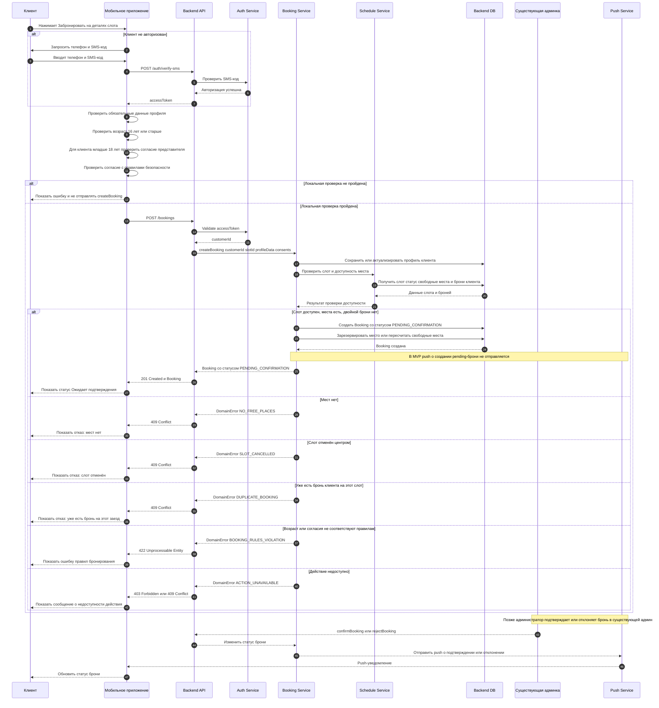

# API sequence: `createBooking`

Источник: `domain-description.md`, `functional-requirements.md`, `use-cases.md`, `user-stories.md`.

## 1. Назначение

Диаграмма описывает последовательность создания брони клиентом после нажатия кнопки **«Забронировать»**.

Граница ответственности:

- мобильное приложение валидирует обязательные пользовательские данные и отправляет запрос в API;
- backend является источником истины и проверяет доступность места, отсутствие двойной брони, статус слота и бизнес-ограничения;
- новая бронь создаётся в статусе **«Ожидает подтверждения»**;
- ручное подтверждение или отклонение брони администратором выполняется позже в существующей админке и не входит в синхронный сценарий `createBooking`;
- push-уведомление о создании брони в ожидании подтверждения в MVP не отправляется.

## 2. Участники

| Участник | Роль |
|---|---|
| `Customer` | Клиент мобильного приложения. |
| `MobileApp` | Клиентское мобильное приложение. |
| `BackendAPI` | API существующего backend. |
| `AuthService` | Проверка авторизации клиента по токену / сессии. |
| `BookingService` | Backend-логика создания брони. |
| `ScheduleService` | Backend-логика слотов, доступности, статусов и свободных мест. |
| `BackendDB` | Хранилище существующего backend. |
| `AdminApp` | Существующая админка; участвует только в последующем изменении статуса. |
| `PushService` | Инфраструктура push-уведомлений; не отправляет push при создании pending-брони в MVP. |

## 3. Предусловия

| ID | Предусловие |
|---|---|
| PRE-001 | Клиент авторизован по номеру телефона с SMS-кодом или проходит авторизацию до бронирования. |
| PRE-002 | Клиент открыл детали слота и видит условия заезда, цену, правила безопасности и условия отмены. |
| PRE-003 | Для бронирования заполнены имя, телефон, email, возраст и согласие с правилами безопасности. |
| PRE-004 | Если клиенту меньше 18 лет, указано согласие родителя или законного представителя. |
| PRE-005 | Если клиенту меньше 16 лет, бронирование должно быть запрещено. |
| PRE-006 | Групповое бронирование в MVP не поддерживается: один запрос создаёт одну бронь на одно место. |

## 4. Основная sequence-диаграмма

> Диаграмма записана в совместимом Mermaid-синтаксисе: для всех участников используется `participant`, без `database`/`actor`, чтобы блок отрисовывался в редакторах со старой версией Mermaid.



## 5. Данные запроса `createBooking`

> Имена полей приведены как проектный API-контракт для фиксации модели. Точный формат контракта может быть уточнён при проектировании API.

```json
{
  "slotId": "string",
  "profile": {
    "fullName": "string",
    "phone": "string",
    "email": "string",
    "age": 18
  },
  "consents": {
    "safetyRulesAccepted": true,
    "parentalConsentAccepted": false
  }
}
```

## 6. Успешный ответ

```json
{
  "bookingId": "string",
  "slotId": "string",
  "customerId": "string",
  "status": "PENDING_CONFIRMATION",
  "createdAt": "2026-07-05T12:00:00+02:00"
}
```

## 7. Основные отказы API

| Код ошибки | Когда возникает | Что должно сделать приложение |
|---|---|---|
| `NO_FREE_PLACES` | На слоте нет свободных мест. | Показать отказ и обновить слот как недоступный для бронирования. |
| `SLOT_CANCELLED` | Слот отменён центром. | Показать, что слот отменён и забронировать его нельзя. |
| `DUPLICATE_BOOKING` | У клиента уже есть бронь на этот заезд. | Показать сообщение, что один аккаунт может иметь только одно место в заезде. |
| `BOOKING_RULES_VIOLATION` | Возраст, согласия или обязательные данные не соответствуют правилам. | Показать ошибку и запросить корректные данные, если действие потенциально исправимо. |
| `ACTION_UNAVAILABLE` | Backend считает действие недоступным. | Показать понятное сообщение о недоступности действия. |
| `UNAUTHORIZED` | Клиент не авторизован или токен недействителен. | Перевести клиента в авторизацию по телефону и SMS-коду. |

## 8. Сущности, которые читаются и изменяются в `createBooking`

| Сущность | Режим в сценарии `createBooking` | Комментарий |
|---|---|---|
| `Customer` | Read / Changed by app via API | Читается по авторизации. Может быть создан или найден при авторизации по телефону. |
| `CustomerProfile` | Changed by app via API | Данные профиля передаются и могут быть сохранены / актуализированы backend. |
| `RideSlot` | Read-only для приложения; backend может пересчитать доступность | Backend проверяет статус слота, свободные места, отмену и ограничения. |
| `TrackConfiguration` | Read-only | Уже показана клиенту на деталях слота, в createBooking напрямую не меняется. |
| `RideLevel` | Read-only | Уже показан клиенту на деталях слота, в createBooking напрямую не меняется. |
| `Marshal` | Read-only | Уже показан клиенту на деталях слота, в createBooking напрямую не меняется. |
| `Booking` | Changed by app via API | Создаётся в статусе `PENDING_CONFIRMATION`. |
| `CenterCancellation` | Read-only | Проверяется через статус отменённого слота / причину отмены, если слот уже отменён. |
| `PushNotification` | Not changed in createBooking MVP | Push о pending-брони не отправляется. Push появится позже при подтверждении, отклонении, напоминании или отмене центром. |
| `Kart` | Derived / external | Участвует только косвенно через вместимость и свободные места слота. |

## 9. Постусловия

### 9.1. Успех

| ID | Постусловие |
|---|---|
| POST-001 | Создана бронь со статусом `PENDING_CONFIRMATION`. |
| POST-002 | Клиент видит статус «Ожидает подтверждения». |
| POST-003 | Место считается занятым / зарезервированным backend, чтобы не допустить двойных броней. |
| POST-004 | Push о создании брони в ожидании подтверждения не отправляется в MVP. |

### 9.2. Ошибка

| ID | Постусловие |
|---|---|
| POST-ERR-001 | Бронь не создана. |
| POST-ERR-002 | Приложение показывает причину отказа в понятной форме. |
| POST-ERR-003 | Приложение полагается на ответ backend как источник истины. |

## 10. Связанные сценарии после `createBooking`

| Сценарий | Когда происходит | Результат |
|---|---|---|
| `confirmBooking` | Администратор подтверждает бронь в существующей админке. | Статус брони становится `ACTIVE`, клиент получает push-уведомление. |
| `rejectBooking` | Администратор отклоняет бронь в существующей админке. | Статус брони становится `REJECTED_BY_CENTER`, клиент получает push-уведомление. |
| `cancelBookingByClient` | Клиент отменяет активную или ожидающую бронь более чем за 1 час до старта. | Статус брони становится `CANCELLED_BY_CLIENT`, место освобождается. |
| `cancelRideByCenter` | Центр отменяет заезд. | Бронь получает `CANCELLED_BY_CENTER`, клиент получает push и видит причину отмены. |
