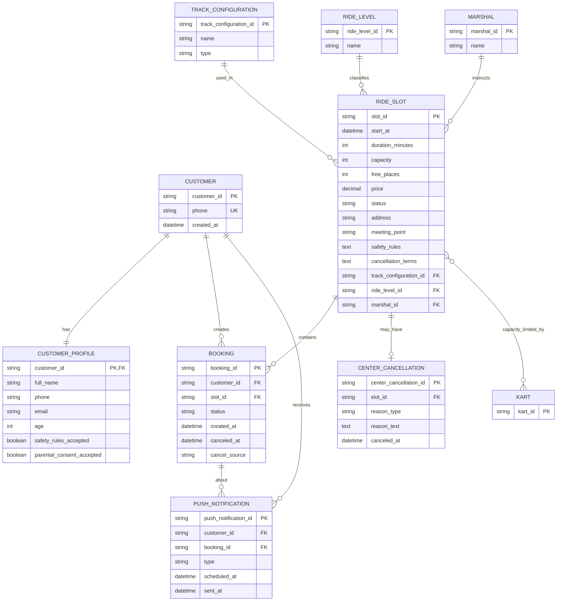

# ER-модель клиентского приложения картинг-центра «Апекс»

Источник: `domain-description.md`, `business-requirements.md`, `functional-requirements.md`, `non-functional-requirements.md`, `use-cases.md`, `user-stories.md`.

## 1. Назначение модели

Модель описывает **концептуальную ER/API-модель** клиентского мобильного приложения поверх существующего backend black-box.

Важно:

- существующий бэкенд является источником истины по расписанию, слотам, доступности, статусам и бизнес-ограничениям;
- мобильное приложение не управляет расписанием, трассами, маршалами, парком картов и административными действиями;
- изменения данных выполняются через API существующего бэкенда;
- серверная транзакционность и внутреннее устройство БД backend находятся вне скоупа клиентского приложения.

## 2. Легенда доступа к сущностям

| Маркер | Значение |
|---|---|
| **Read-only** | Клиентское приложение только получает и отображает данные сущности из API. |
| **Changed by app via API** | Клиентское приложение инициирует создание или изменение сущности через API. Фактическое изменение выполняет backend. |
| **Changed outside app** | Сущность изменяется существующей админкой, backend-процессами или инфраструктурой. Клиентское приложение только получает итоговое состояние. |
| **Derived / external** | Сущность влияет на бизнес-правила, но в MVP не является самостоятельным объектом управления или редактирования в клиентском приложении. |

## 3. Сущности и режим доступа

| Сущность | Режим доступа для клиентского приложения | Что хранит / отражает | Основание |
|---|---|---|---|
| `Customer` / Клиент | **Changed by app via API** | Аккаунт клиента, авторизуемый по номеру телефона. | BR-004, FR-008, UC-001, US-004 |
| `CustomerProfile` / Профиль клиента | **Changed by app via API** | Имя, телефон, email, возраст, согласие с правилами безопасности, при необходимости согласие родителя / законного представителя. | BR-012, BR-013, BR-014, FR-009, FR-010 |
| `RideSlot` / Заезд, слот | **Read-only**; изменения статуса выполняются **outside app** | Конкретный старт в расписании: дата, время, трасса, уровень, маршал, вместимость, свободные места, цена, статус. | BR-002, BR-003, BR-011, FR-001–FR-006 |
| `TrackConfiguration` / Конфигурация трассы | **Read-only** | Короткая / длинная конфигурация трассы. | FR-003, FR-006 |
| `RideLevel` / Уровень заезда | **Read-only** | Новичковый / опытный уровень сложности. | FR-003, FR-006 |
| `Marshal` / Маршал-инструктор | **Read-only** | Инструктор, назначенный на слот. Назначение выполняется вне клиентского приложения. | FR-006, NFR-005, NFR-007 |
| `Booking` / Бронь | **Changed by app via API** для создания и клиентской отмены; подтверждение, отклонение, завершение и неявка — **outside app** | Запись клиента на конкретный заезд и её статус. | BR-005–BR-007, BR-019–BR-024, FR-011–FR-021 |
| `CenterCancellation` / Отмена заезда центром | **Read-only**; создаётся **outside app** | Причина отмены заезда центром, дата отмены и связанный слот. | BR-009, BR-024, BR-025, FR-022, FR-023 |
| `PushNotification` / Push-уведомление | **Read-only** для приложения как получателя; создаётся/отправляется **outside app** | Уведомления о подтверждении, отклонении, напоминании и отмене заезда центром. | BR-008, FR-024–FR-028 |
| `Kart` / Карт | **Derived / external** | Количество картов влияет на вместимость слота. Управление парком картов вне скоупа MVP. | BR-010, BR-016, NFR-005 |

## 4. ER-диаграмма

## 5. Описание сущностей

### 5.1. `Customer`

Клиент мобильного приложения. Входит по номеру телефона с подтверждением через SMS-код.

**Доступ:** приложение инициирует регистрацию / авторизацию через API.

**Ключевые правила:**

- номер телефона используется для входа;
- клиент может просматривать слоты, создавать бронь, смотреть свои брони и отменять бронь по правилам центра.

### 5.2. `CustomerProfile`

Профиль клиента с данными, обязательными для бронирования.

**Доступ:** приложение инициирует заполнение или актуализацию данных через API в момент подготовки к бронированию или создания брони.

**Атрибуты:**

| Атрибут | Обязательность | Комментарий |
|---|---:|---|
| `full_name` | Да | Имя клиента. |
| `phone` | Да | Телефон клиента. |
| `email` | Да | Email клиента. |
| `age` | Да | Возраст клиента. |
| `safety_rules_accepted` | Да | Согласие с правилами безопасности. |
| `parental_consent_accepted` | Условно | Обязательно, если клиенту меньше 18 лет. |

**Бизнес-правила:**

- минимальный возраст участия — 16 лет;
- клиент младше 16 лет не может записаться на заезд;
- для клиентов младше 18 лет требуется согласие родителя или законного представителя.

### 5.3. `RideSlot`

Конкретный заезд в расписании.

**Доступ:** приложение только читает слоты из API. Формирование расписания, изменение статуса слота, назначение маршала и отмена заезда центром выполняются вне клиентского приложения.

**Атрибуты:**

| Атрибут | Комментарий |
|---|---|
| `start_at` | Дата и время старта заезда. |
| `duration_minutes` | Длительность заезда. |
| `track_configuration_id` | Конфигурация трассы. |
| `ride_level_id` | Уровень сложности. |
| `marshal_id` | Назначенный маршал-инструктор. |
| `capacity` | Вместимость заезда. |
| `free_places` | Количество свободных мест. |
| `price` | Цена за участие. |
| `status` | Статус слота: доступен, мест нет, отменён. |
| `address` | Адрес картинг-центра. |
| `meeting_point` | Место сбора на территории. |
| `safety_rules` | Правила безопасности. |
| `cancellation_terms` | Условия отмены. |

**Бизнес-правила:**

- по умолчанию показываются слоты на ближайшие 7 дней;
- если расписания нет, приложение показывает пустое состояние;
- слот без свободных мест недоступен для бронирования;
- отменённый центром слот недоступен для бронирования;
- повторная запись на отменённый слот запрещена;
- время, к которому нужно приехать заранее, в MVP не показывается.

### 5.4. `TrackConfiguration`

Конфигурация трассы.

**Доступ:** только чтение.

**Значения из домена:**

- короткая;
- длинная.

### 5.5. `RideLevel`

Уровень сложности заезда.

**Доступ:** только чтение.

**Значения из домена:**

- новичковый;
- опытный.

### 5.6. `Marshal`

Маршал-инструктор, назначенный на слот.

**Доступ:** только чтение в клиентском приложении.

Назначение маршалов выполняется в существующей инфраструктуре и не входит в MVP клиентского приложения.

### 5.7. `Booking`

Бронь клиента на конкретный слот.

**Доступ:**

- приложение создаёт бронь через API;
- приложение инициирует отмену брони клиентом через API;
- приложение читает актуальные статусы своих броней;
- подтверждение, отклонение, завершение и фиксация неявки выполняются вне клиентского приложения.

**Статусы брони:**

| Статус | Код в модели | Кто меняет |
|---|---|---|
| Ожидает подтверждения | `PENDING_CONFIRMATION` | Backend при создании брони по запросу приложения |
| Активна | `ACTIVE` | Администратор / существующая админка |
| Отменена клиентом | `CANCELLED_BY_CLIENT` | Backend по запросу приложения |
| Отменена центром | `CANCELLED_BY_CENTER` | Центр / существующая инфраструктура |
| Отклонена центром | `REJECTED_BY_CENTER` | Администратор / существующая админка |
| Завершена | `COMPLETED` | Существующая инфраструктура |
| Неявка | `NO_SHOW` | Существующая инфраструктура |

**Бизнес-правила:**

- один аккаунт клиента может забронировать только одно место в одном заезде;
- групповое бронирование в MVP не поддерживается;
- бронь создаётся в статусе `PENDING_CONFIRMATION`;
- автоматического тайм-аута подтверждения в MVP нет;
- клиент может отменить активную или ожидающую бронь только если до старта заезда осталось больше 1 часа;
- при успешной отмене клиентом место сразу освобождается;
- за 1 час или меньше до старта отмена через приложение запрещена.

### 5.8. `CenterCancellation`

Отмена заезда центром.

**Доступ:** приложение только читает результат отмены. Отмена создаётся существующей инфраструктурой.

**Причины отмены:**

| Причина | Код в модели |
|---|---|
| Погодные условия | `WEATHER` |
| Техническая неисправность | `TECHNICAL_FAILURE` |
| Недоступность трассы | `TRACK_UNAVAILABLE` |
| Недоступность маршала | `MARSHAL_UNAVAILABLE` |
| Организационная причина | `ORGANIZATIONAL` |
| Другое | `OTHER` |

Если указана причина `OTHER`, используется свободный текст `reason_text`.

### 5.9. `PushNotification`

Push-уведомление клиенту.

**Доступ:** клиентское приложение получает уведомления. Создание, планирование и отправка выполняются backend / инфраструктурой уведомлений.

**Типы уведомлений в MVP:**

| Событие | Код в модели | Отправляется в MVP |
|---|---|---|
| Бронь подтверждена администратором | `BOOKING_CONFIRMED` | Да |
| Бронь отклонена администратором | `BOOKING_REJECTED` | Да |
| Напоминание за 24 часа | `RIDE_REMINDER_24H` | Да |
| Напоминание за 2 часа | `RIDE_REMINDER_2H` | Да |
| Заезд отменён центром | `RIDE_CANCELLED_BY_CENTER` | Да |
| Бронь создана и ожидает подтверждения | `BOOKING_CREATED_PENDING` | Нет в MVP |
| Бронь отменена клиентом | `BOOKING_CANCELLED_BY_CLIENT` | Нет в MVP |
| Отмена запрещена из-за порога 1 час | `CANCELLATION_DENIED_1H` | Нет в MVP |

### 5.10. `Kart`

Карт как единица парка техники.

**Доступ:** в клиентском приложении не управляется и напрямую не редактируется.

В клиентской модели карт отражён только как внешний фактор, влияющий на `RideSlot.capacity` и `RideSlot.free_places`. Управление парком картов находится вне скоупа MVP.

## 6. Кардинальности

| Связь | Кардинальность | Описание |
|---|---|---|
| `Customer` — `CustomerProfile` | 1 : 1 | У клиента один профиль с обязательными данными для бронирования. |
| `Customer` — `Booking` | 1 : N | Клиент может иметь несколько броней в разные заезды. |
| `RideSlot` — `Booking` | 1 : N | На один слот может быть создано несколько броней в пределах вместимости. |
| `Customer` + `RideSlot` — `Booking` | 1 : 0..1 | Один аккаунт может иметь только одну бронь на один заезд. |
| `TrackConfiguration` — `RideSlot` | 1 : N | Одна конфигурация трассы используется во многих слотах. |
| `RideLevel` — `RideSlot` | 1 : N | Один уровень сложности используется во многих слотах. |
| `Marshal` — `RideSlot` | 1 : N | Один маршал может быть назначен на несколько слотов. |
| `RideSlot` — `CenterCancellation` | 1 : 0..1 | У слота может быть одна отмена центром. |
| `Customer` — `PushNotification` | 1 : N | Клиент может получить несколько push-уведомлений. |
| `Booking` — `PushNotification` | 1 : N | Уведомления могут быть связаны с конкретной бронью. |
| `RideSlot` — `Kart` | M : N / derived | Количество доступных картов влияет на вместимость слота, но назначение картов не управляется клиентским приложением. |

## 7. Ограничения целостности и бизнес-правила

| ID | Правило | Проверяет / обеспечивает |
|---|---|---|
| DM-RULE-001 | Слоты по умолчанию запрашиваются на ближайшие 7 дней. | Клиентское приложение + API |
| DM-RULE-002 | Нельзя создать бронь на слот без свободных мест. | Backend; клиент обрабатывает отказ |
| DM-RULE-003 | Нельзя создать бронь на отменённый слот. | Backend; клиент отображает слот как недоступный |
| DM-RULE-004 | Один аккаунт может иметь только одно место в одном заезде. | Backend; клиент обрабатывает отказ |
| DM-RULE-005 | Для бронирования обязательны имя, телефон, email, возраст и согласие с правилами безопасности. | Клиентское приложение + API |
| DM-RULE-006 | Клиент младше 16 лет не может создать бронь. | Клиентское приложение + API |
| DM-RULE-007 | Для клиента младше 18 лет требуется согласие родителя / законного представителя. | Клиентское приложение + API |
| DM-RULE-008 | Новая бронь создаётся только в статусе `PENDING_CONFIRMATION`. | Backend |
| DM-RULE-009 | Подтверждение или отклонение брони выполняется администратором вне приложения. | Существующая админка |
| DM-RULE-010 | Отменить бронь через приложение можно только более чем за 1 час до старта. | Клиентское приложение + API |
| DM-RULE-011 | При успешной клиентской отмене место сразу освобождается. | Backend |
| DM-RULE-012 | При отмене заезда центром бронь не удаляется, а получает статус `CANCELLED_BY_CENTER`. | Backend / существующая инфраструктура |
| DM-RULE-013 | Автоматического тайм-аута подтверждения в MVP нет. | Backend / продуктовая логика |
| DM-RULE-014 | Push о создании брони в ожидании, клиентской отмене и запрете отмены из-за порога 1 час в MVP не отправляется. | Backend / push-инфраструктура |

## 8. Что сознательно не включено в модель MVP

| Объект / область | Причина |
|---|---|
| Онлайн-оплата | Отложено за пределы MVP. |
| Выбор экипировки | Отложено за пределы MVP. |
| Оценка маршала | Отложено за пределы MVP. |
| Расширенная программа лояльности | Отложено за пределы MVP. |
| Фильтры по дате / времени / трассе | Отложено за пределы MVP. |
| Управление расписанием | Выполняется существующей инфраструктурой. |
| Назначение маршалов | Выполняется существующей инфраструктурой. |
| Управление парком картов | Выполняется существующей инфраструктурой. |
| Административная отмена слота из приложения | В клиентском приложении не реализуется. |
| Серверная транзакционность и физическая схема БД | Вне скоупа клиентского приложения и скрыто backend black-box. |
