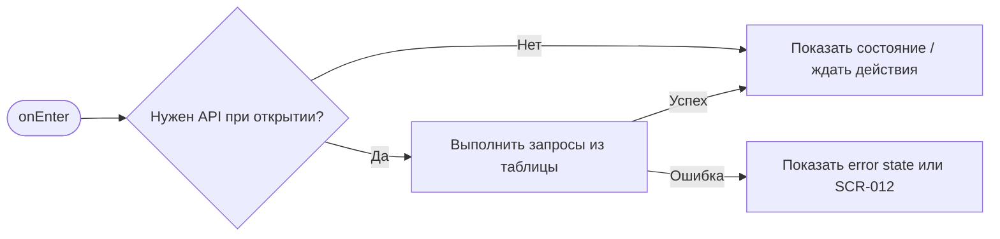
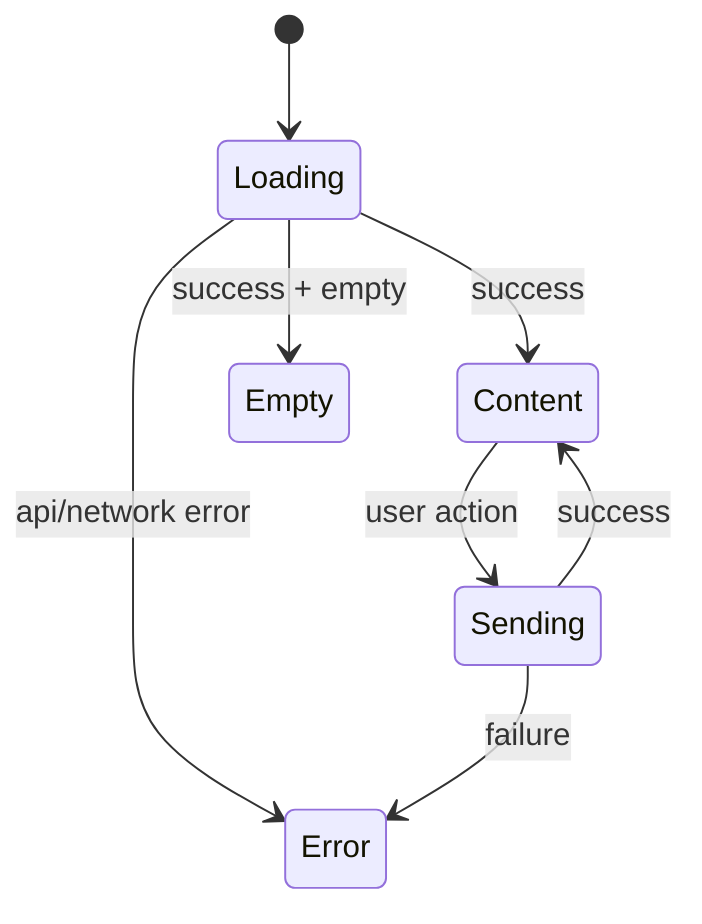

# SCR-001. Ввод номера телефона

**ID:** SCR-001  
**Тип:** Экран / состояние  
**Домен:** MVP мобильного приложения «Апекс»  
**Приоритет:** Critical  
**Статус:** Актуален  
**Функциональные блоки:** LOGIC-001 Авторизация по SMS, LOGIC-007 Обработка ошибок API  
**Зона авторизации:** НЗ  
**Дизайн-макет:** не предоставлен; исходная постановка дизайна — [`scr-001-vvod-nomera-telefona.md`](../00_Исходники/scr-001-vvod-nomera-telefona.md).

---

## История изменений

| Релиз | ТЗ | Описание изменений |
|---|---|---|
| 1.0.0-mvp | SCR-001. Ввод номера телефона | Первичная постановка ТЗ по дизайну, API и шаблону |

---

## Обзор

Пользователь должен начать вход в приложение, указав номер телефона для получения SMS-кода.

### Контекст появления

Экран открывается:

- при первом запуске приложения, если пользователь не авторизован;
- при попытке забронировать слот без авторизации;

### Главный дизайн-акцент

Экран должен быть максимально простым: пользователь должен сразу понять, что для входа нужен номер телефона, а подтверждение будет через SMS.

### User Story

> Как клиент картинг-центра, я хочу выполнить сценарий «Ввод номера телефона», чтобы пользоваться MVP без лишних действий и не сталкиваться с недоступными функциями.

### Бизнес-ценность

- Закрывает обязательный пользовательский сценарий MVP.
- Использует только функции, описанные в требованиях и OpenAPI.
- Не добавляет исключённые функции: оплату, групповое бронирование, фильтры, экипировку, лояльность и административные действия.

---

## Навигация

### Входящая

| Источник | Триггер / условие | Передаваемые параметры |
|---|---|---|
| Сценарии приложения | первый запуск без авторизации; попытка бронирования без авторизации; переход из push/deep link при отсутствии токена | см. параметры в разделе входных данных |

### Исходящая

| Назначение | Триггер / условие | Передаваемые параметры |
|---|---|---|
| Сценарии приложения | SCR-002 после 202; назад в предыдущий сценарий | зависит от действия и ответа API |

---

## Входные данные

| Название | Тип | Возможные значения | Описание |
|---|---|---|---|
| accessToken | Защищённое хранилище | JWT / отсутствует | Используется на защищённых экранах и при возврате из авторизации |
| slotId | Параметр навигации | string | Используется в сценариях слота, если применимо |
| bookingId | Параметр навигации / push payload | string | Используется в сценариях брони, если применимо |
| returnTo | Состояние навигации | SCR-* | Маршрут возврата после авторизации |

---

## Применяемые логики

| Логика | Элемент/Триггер | Описание |
|---|---|---|
| LOGIC-001 Авторизация по SMS | см. экранные действия | Переиспользуемая логика вынесена в раздел 09_Логики |
| LOGIC-007 Обработка ошибок API | см. экранные действия | Переиспользуемая логика вынесена в раздел 09_Логики |

---

## Инициализация

### Диаграмма загрузки



### Запросы при открытии / действии

| № | Запрос | Критичный | Условие |
|---|---|---|---|
| 1 | POST /auth/request-sms | Да | см. секцию API |

---

## Используемые запросы

### POST /auth/request-sms

**Тип:** REST  
**Спецификация:** [`00_Исходники/openapi-apex-mobile.yaml`](../00_Исходники/openapi-apex-mobile.yaml) → `requestSmsCode`  
**Назначение:** Запросить SMS-код для входа

**Параметры:**

| Параметр | Тип | Обязательность | Описание |
|---|---|---|---|
| — | — | — | Нет path/query параметров |

**Body:**

| Параметр | Тип | Обязательность | Описание |
|---|---|---|---|
| body | RequestSmsCodeRequest | Да | JSON body по OpenAPI |

**Ответы:**

| Код | Описание |
|---|---|
| 202 | SMS-код принят к отправке. |
| 400 | Ошибка валидации входных данных. |
| 429 | Слишком много попыток. |
| 500 | Внутренняя ошибка backend без раскрытия технических деталей клиенту. |


---

## Макет экрана

```text
┌─────────────────────────────────────┐
│ Header / статус / навигация         │
├─────────────────────────────────────┤
│ Основной контент                    │
│ Поля, карточки, состояния или текст │
├─────────────────────────────────────┤
│ Primary / Secondary actions         │
└─────────────────────────────────────┘
```

---

## Элементы экрана

### Обязательный контент

- Название или приветствие приложения / картинг-центра «Апекс».
- Поле ввода номера телефона.
- Пояснение, что на номер будет отправлен SMS-код.
- Основная кнопка продолжения.
- Нейтральное сообщение о невозможности бронирования без авторизации, если экран открыт из сценария бронирования.

### Микрокопирайтинг

- Заголовок: «Вход в Апекс».
- Подсказка: «Введите номер телефона — отправим SMS-код для подтверждения».
- Кнопка: «Получить код».
- Ошибка: «Проверьте номер телефона».

### Не проектировать

- Вход по email и паролю.
- Социальные сети.
- Регистрационную анкету профиля вне данных, нужных для бронирования.

---

## Состояния экрана

- Пустое поле.
- Невалидный номер телефона.
- Валидный номер телефона.
- Отправка кода / ожидание.
- Ошибка отправки кода.

### Диаграмма переходов



---

## Действия пользователя

| Действие | Ожидаемый результат |
|---|---|
| Ввести номер телефона | Кнопка продолжения становится доступной после валидного ввода |
| Нажать «Получить код» | Пользователь переходит на SCR-002 |
| Вернуться назад | Пользователь возвращается на предыдущий экран, если вход был вызван из сценария бронирования |

---

## Связанные требования

BR-004, FR-008, UC-001, US-004.

---

## Критерии приёмки

### Из дизайна

- Пользователь понимает, что вход выполняется по телефону.
- Есть состояние ошибки для номера телефона.
- Есть состояние ожидания отправки кода.
- Экран не содержит альтернативных способов авторизации, не описанных в MVP.

### Технические критерии

| ID | Критерий | Приоритет |
|---|---|---|
| AC-T01 | Дано экран открыт, Когда требуется API, Тогда выполняется только endpoint, указанный в разделе «Используемые запросы». | P0 |
| AC-T02 | Дано API вернул ошибку 4xx/5xx или сеть недоступна, Когда сценарий не может продолжиться, Тогда пользователь видит понятное состояние без внутренних кодов. | P0 |
| AC-T03 | Дано действие недоступно по данным API (`canBook`, `canCancel`, `status`), Когда экран отображается, Тогда CTA не выглядит доступным. | P0 |
| AC-T04 | Дано пользователь проходит сценарий через авторизацию, Когда вход успешен, Тогда приложение возвращает его в сохранённый `returnTo`. | P1 |

---

## Обработка ошибок и ограничений

- Нельзя продолжить без номера телефона.
- Нельзя продолжить с визуально невалидным номером телефона.
- Техническую ошибку отправки кода показывать понятно, без технических деталей.
