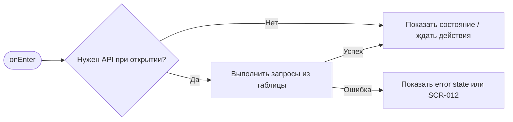
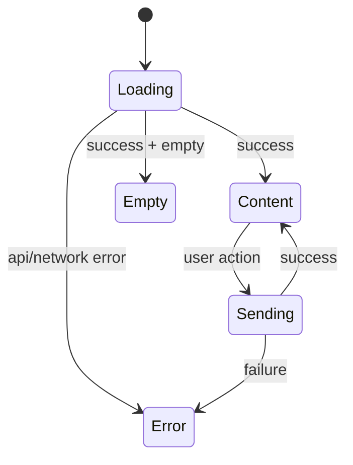

# SCR-002. Ввод SMS-кода

**ID:** SCR-002  
**Тип:** Экран / состояние  
**Домен:** MVP мобильного приложения «Апекс»  
**Приоритет:** Critical  
**Статус:** Актуален  
**Функциональные блоки:** LOGIC-001 Авторизация по SMS, LOGIC-006 Push-уведомления, LOGIC-007 Обработка ошибок API  
**Зона авторизации:** НЗ  
**Дизайн-макет:** не предоставлен; исходная постановка дизайна — [`scr-002-vvod-sms-koda.md`](../00_Исходники/scr-002-vvod-sms-koda.md).

---

## История изменений

| Релиз | ТЗ | Описание изменений |
|---|---|---|
| 1.0.0-mvp | SCR-002. Ввод SMS-кода | Первичная постановка ТЗ по дизайну, API и шаблону |

---

## Обзор

Пользователь должен подтвердить номер телефона SMS-кодом и получить доступ к действиям приложения.

### Контекст появления

Экран открывается после отправки номера телефона на SCR-001.

### Главный дизайн-акцент

Пользователь должен видеть, на какой номер отправлен код, и понимать, что нужно ввести код из SMS.

### User Story

> Как клиент картинг-центра, я хочу выполнить сценарий «Ввод SMS-кода», чтобы пользоваться MVP без лишних действий и не сталкиваться с недоступными функциями.

### Бизнес-ценность

- Закрывает обязательный пользовательский сценарий MVP.
- Использует только функции, описанные в требованиях и OpenAPI.
- Не добавляет исключённые функции: оплату, групповое бронирование, фильтры, экипировку, лояльность и административные действия.

---

## Навигация

### Входящая

| Источник | Триггер / условие | Передаваемые параметры |
|---|---|---|
| Сценарии приложения | после успешного запроса SMS-кода на SCR-001 | см. параметры в разделе входных данных |

### Исходящая

| Назначение | Триггер / условие | Передаваемые параметры |
|---|---|---|
| Сценарии приложения | целевой returnTo или SCR-003 после успешного входа; SCR-001 по «Изменить номер» | зависит от действия и ответа API |

---

## Входные данные

| Название | Тип | Возможные значения | Описание |
|---|---|---|---|
| accessToken | Защищённое хранилище | JWT / отсутствует | Используется на защищённых экранах и при возврате из авторизации |
| slotId | Параметр навигации | string | Используется в сценариях слота, если применимо |
| bookingId | Параметр навигации / push payload | string | Используется в сценариях брони, если применимо |
| returnTo | Состояние навигации | SCR-* | Маршрут возврата после авторизации |

---

## Применяемые логики

| Логика | Элемент/Триггер | Описание |
|---|---|---|
| LOGIC-001 Авторизация по SMS | см. экранные действия | Переиспользуемая логика вынесена в раздел 09_Логики |
| LOGIC-006 Push-уведомления | см. экранные действия | Переиспользуемая логика вынесена в раздел 09_Логики |
| LOGIC-007 Обработка ошибок API | см. экранные действия | Переиспользуемая логика вынесена в раздел 09_Логики |

---

## Инициализация

### Диаграмма загрузки



### Запросы при открытии / действии

| № | Запрос | Критичный | Условие |
|---|---|---|---|
| 1 | POST /auth/verify-sms | Нет/по действию | см. секцию API |
| 2 | POST /push/device-tokens | Нет/по действию | см. секцию API |

---

## Используемые запросы

### POST /auth/verify-sms

**Тип:** REST  
**Спецификация:** [`00_Исходники/openapi-apex-mobile.yaml`](../00_Исходники/openapi-apex-mobile.yaml) → `verifySmsCode`  
**Назначение:** Подтвердить SMS-код и получить access token

**Параметры:**

| Параметр | Тип | Обязательность | Описание |
|---|---|---|---|
| — | — | — | Нет path/query параметров |

**Body:**

| Параметр | Тип | Обязательность | Описание |
|---|---|---|---|
| body | VerifySmsCodeRequest | Да | JSON body по OpenAPI |

**Ответы:**

| Код | Описание |
|---|---|
| 200 | Авторизация успешна. |
| 400 | Ошибка валидации входных данных. |
| 401 | SMS-код неверный или истёк. |
| 429 | Слишком много попыток. |
| 500 | Внутренняя ошибка backend без раскрытия технических деталей клиенту. |

### POST /push/device-tokens

**Тип:** REST  
**Спецификация:** [`00_Исходники/openapi-apex-mobile.yaml`](../00_Исходники/openapi-apex-mobile.yaml) → `registerPushDeviceToken`  
**Назначение:** Зарегистрировать device token для push-уведомлений

**Параметры:**

| Параметр | Тип | Обязательность | Описание |
|---|---|---|---|
| — | — | — | Нет path/query параметров |

**Body:**

| Параметр | Тип | Обязательность | Описание |
|---|---|---|---|
| body | RegisterPushDeviceTokenRequest | Да | JSON body по OpenAPI |

**Ответы:**

| Код | Описание |
|---|---|
| 201 | Device token зарегистрирован. |
| 400 | Ошибка валидации входных данных. |
| 401 | Клиент не авторизован или токен недействителен. |
| 500 | Внутренняя ошибка backend без раскрытия технических деталей клиенту. |


---

## Макет экрана

```text
┌─────────────────────────────────────┐
│ Header / статус / навигация         │
├─────────────────────────────────────┤
│ Основной контент                    │
│ Поля, карточки, состояния или текст │
├─────────────────────────────────────┤
│ Primary / Secondary actions         │
└─────────────────────────────────────┘
```

---

## Элементы экрана

### Обязательный контент

- Заголовок подтверждения номера.
- Маскированный или отображаемый номер телефона, на который отправлен код.
- Поле ввода SMS-кода.
- Кнопка подтверждения.
- Возможность вернуться к изменению номера.

### Микрокопирайтинг

- Заголовок: «Введите код из SMS».
- Подсказка: «Мы отправили код на номер …».
- Кнопка: «Войти».
- Ссылка: «Изменить номер».
- Ошибка: «Код не подошёл. Проверьте SMS и попробуйте ещё раз».

### Не проектировать

- Восстановление пароля.
- Парольный вход.
- Биометрию как обязательный сценарий MVP.

---

## Состояния экрана

- Пустой код.
- Неполный код.
- Неверный код.
- Проверка кода.
- Успешное подтверждение.

### Диаграмма переходов



---

## Действия пользователя

| Действие | Ожидаемый результат |
|---|---|
| Ввести SMS-код | Кнопка подтверждения становится доступной |
| Нажать «Войти» | Пользователь попадает в приложение |
| Изменить номер | Возврат на SCR-001 |

---

## Связанные требования

FR-008, UC-001, US-004.

---

## Критерии приёмки

### Из дизайна

- Понятно, какой номер подтверждается.
- Есть сценарий исправления номера.
- Есть состояние неверного кода.
- После успеха пользователь логично попадает к выбору заезда или к действию, ради которого авторизовался.

### Технические критерии

| ID | Критерий | Приоритет |
|---|---|---|
| AC-T01 | Дано экран открыт, Когда требуется API, Тогда выполняется только endpoint, указанный в разделе «Используемые запросы». | P0 |
| AC-T02 | Дано API вернул ошибку 4xx/5xx или сеть недоступна, Когда сценарий не может продолжиться, Тогда пользователь видит понятное состояние без внутренних кодов. | P0 |
| AC-T03 | Дано действие недоступно по данным API (`canBook`, `canCancel`, `status`), Когда экран отображается, Тогда CTA не выглядит доступным. | P0 |
| AC-T04 | Дано пользователь проходит сценарий через авторизацию, Когда вход успешен, Тогда приложение возвращает его в сохранённый `returnTo`. | P1 |

---

## Обработка ошибок и ограничений

- Нельзя подтвердить вход без кода.
- Неверный код должен быть объяснён простым сообщением.
- Не использовать технические формулировки ошибок.
