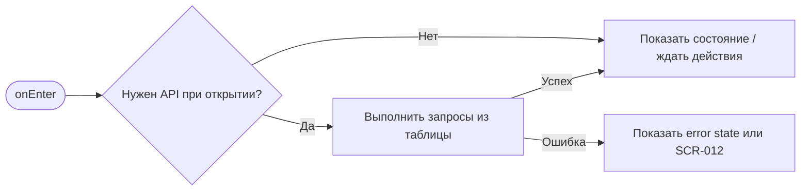
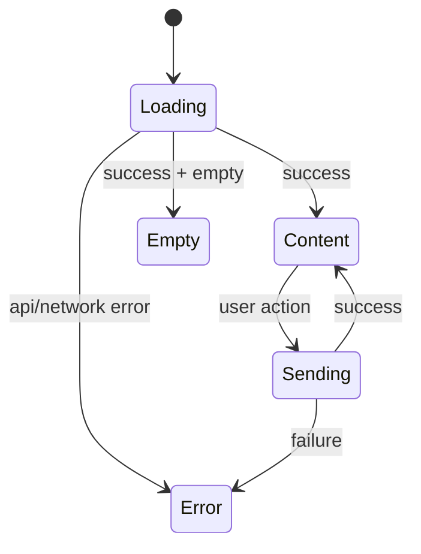

# SCR-004. Пустое расписание

**ID:** SCR-004  
**Тип:** Экран / состояние  
**Домен:** MVP мобильного приложения «Апекс»  
**Приоритет:** High  
**Статус:** Актуален  
**Функциональные блоки:** LOGIC-002 Загрузка расписания слотов, LOGIC-007 Обработка ошибок API  
**Зона авторизации:** АЗ  
**Дизайн-макет:** не предоставлен; исходная постановка дизайна — [`scr-004-pustoe-raspisanie.md`](../00_Исходники/scr-004-pustoe-raspisanie.md).

---

## История изменений

| Релиз | ТЗ | Описание изменений |
|---|---|---|
| 1.0.0-mvp | SCR-004. Пустое расписание | Первичная постановка ТЗ по дизайну, API и шаблону |

---

## Обзор

Пользователь должен понять, что на ближайшие дни доступных заездов пока нет.

### Контекст появления

Состояние отображается внутри SCR-003, если приложение не получает расписание на ближайшие дни.

### Главный дизайн-акцент

Пустое состояние должно быть спокойным и понятным, без ощущения ошибки пользователя.

### User Story

> Как клиент картинг-центра, я хочу выполнить сценарий «Пустое расписание», чтобы пользоваться MVP без лишних действий и не сталкиваться с недоступными функциями.

### Бизнес-ценность

- Закрывает обязательный пользовательский сценарий MVP.
- Использует только функции, описанные в требованиях и OpenAPI.
- Не добавляет исключённые функции: оплату, групповое бронирование, фильтры, экипировку, лояльность и административные действия.

---

## Навигация

### Входящая

| Источник | Триггер / условие | Передаваемые параметры |
|---|---|---|
| Сценарии приложения | как состояние SCR-003, если список слотов пуст | см. параметры в разделе входных данных |

### Исходящая

| Назначение | Триггер / условие | Передаваемые параметры |
|---|---|---|
| Сценарии приложения | SCR-003 по «Обновить»; SCR-008 через навигацию | зависит от действия и ответа API |

---

## Входные данные

| Название | Тип | Возможные значения | Описание |
|---|---|---|---|
| accessToken | Защищённое хранилище | JWT / отсутствует | Используется на защищённых экранах и при возврате из авторизации |
| slotId | Параметр навигации | string | Используется в сценариях слота, если применимо |
| bookingId | Параметр навигации / push payload | string | Используется в сценариях брони, если применимо |
| returnTo | Состояние навигации | SCR-* | Маршрут возврата после авторизации |

---

## Применяемые логики

| Логика | Элемент/Триггер | Описание |
|---|---|---|
| LOGIC-002 Загрузка расписания слотов | см. экранные действия | Переиспользуемая логика вынесена в раздел 09_Логики |
| LOGIC-007 Обработка ошибок API | см. экранные действия | Переиспользуемая логика вынесена в раздел 09_Логики |

---

## Инициализация

### Диаграмма загрузки



### Запросы при открытии / действии

| № | Запрос | Критичный | Условие |
|---|---|---|---|
| 1 | GET /ride-slots | Да | см. секцию API |

---

## Используемые запросы

### GET /ride-slots

**Тип:** REST  
**Спецификация:** [`00_Исходники/openapi-apex-mobile.yaml`](../00_Исходники/openapi-apex-mobile.yaml) → `listRideSlots`  
**Назначение:** Получить список слотов

**Параметры:**

| Параметр | Тип | Обязательность | Описание |
|---|---|---|---|
| days | integer | Нет | Количество дней от текущего момента. Для MVP клиент использует значение по умолчанию 7. |
| includeUnavailable | boolean | Нет | Включать занятые и отменённые слоты, чтобы приложение могло показать статусы «Мест нет» и «Отменён». |

**Body:**

| Параметр | Тип | Обязательность | Описание |
|---|---|---|---|
| — | — | — | Нет тела запроса |

**Ответы:**

| Код | Описание |
|---|---|
| 200 | Список слотов. Пустой массив означает отсутствие расписания на ближайшие дни. |
| 401 | Клиент не авторизован или токен недействителен. |
| 500 | Внутренняя ошибка backend без раскрытия технических деталей клиенту. |


---

## Макет экрана

```text
┌─────────────────────────────────────┐
│ Header / статус / навигация         │
├─────────────────────────────────────┤
│ Основной контент                    │
│ Поля, карточки, состояния или текст │
├─────────────────────────────────────┤
│ Primary / Secondary actions         │
└─────────────────────────────────────┘
```

---

## Элементы экрана

### Обязательный контент

- Иллюстративный или текстовый пустой блок.
- Сообщение об отсутствии доступных заездов.
- Возможность повторить загрузку, если это применимо для состояния ошибки; для настоящего пустого расписания не обещать наличие новых слотов.

### Микрокопирайтинг

- Заголовок: «Пока нет доступных заездов».
- Пояснение: «На ближайшие дни расписание ещё не доступно».
- Кнопка: «Обновить».

### Не проектировать

- Подбор альтернатив по фильтрам.
- Подписку на появление слотов, если она не описана в требованиях.

---

## Состояния экрана

- Нет доступных заездов.
- Ошибка загрузки заездов.

### Диаграмма переходов



---

## Действия пользователя

| Действие | Ожидаемый результат |
|---|---|
| Остаться на экране | Пользователь видит понятное объяснение |
| Обновить список | Приложение повторно пытается загрузить слоты, если есть соответствующее действие |
| Перейти в «Мои брони» | Открывается SCR-008 |

---

## Связанные требования

FR-002, UC-003, US-002.

---

## Критерии приёмки

### Из дизайна

- Пустое состояние отличается от ошибки загрузки.
- Пользователь понимает, что проблема не в его действиях.
- Экран не предлагает несуществующие MVP-функции.

### Технические критерии

| ID | Критерий | Приоритет |
|---|---|---|
| AC-T01 | Дано экран открыт, Когда требуется API, Тогда выполняется только endpoint, указанный в разделе «Используемые запросы». | P0 |
| AC-T02 | Дано API вернул ошибку 4xx/5xx или сеть недоступна, Когда сценарий не может продолжиться, Тогда пользователь видит понятное состояние без внутренних кодов. | P0 |
| AC-T03 | Дано действие недоступно по данным API (`canBook`, `canCancel`, `status`), Когда экран отображается, Тогда CTA не выглядит доступным. | P0 |
| AC-T04 | Дано пользователь проходит сценарий через авторизацию, Когда вход успешен, Тогда приложение возвращает его в сохранённый `returnTo`. | P1 |

---

## Обработка ошибок и ограничений

- Не показывать пустое расписание как техническую ошибку.
- Не предлагать фильтры, если они не входят в MVP.
