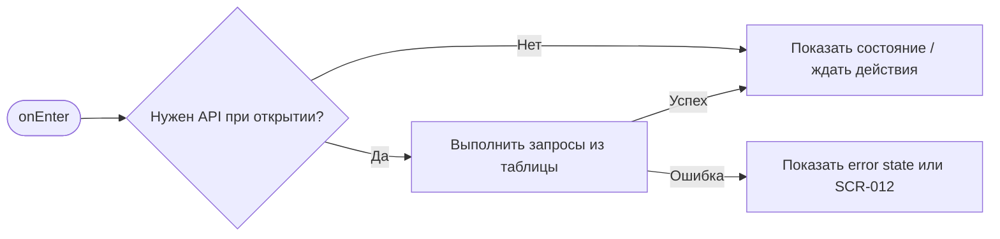
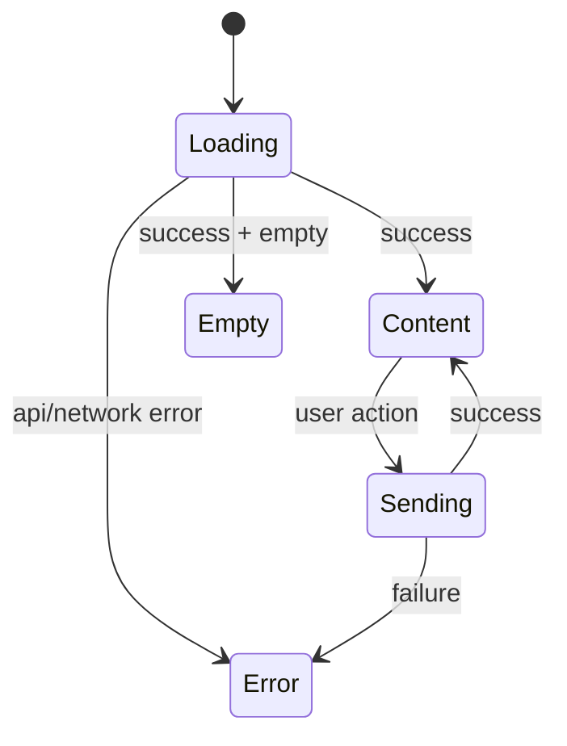

# SCR-005. Детали слота

**ID:** SCR-005  
**Тип:** Экран / состояние  
**Домен:** MVP мобильного приложения «Апекс»  
**Приоритет:** Critical  
**Статус:** Актуален  
**Функциональные блоки:** LOGIC-003 Детали слота и переход к бронированию, LOGIC-001 Авторизация по SMS, LOGIC-007 Обработка ошибок API  
**Зона авторизации:** НЗ + АЗ  
**Дизайн-макет:** не предоставлен; исходная постановка дизайна — [`scr-005-detali-slota.md`](../00_Исходники/scr-005-detali-slota.md).

---

## История изменений

| Релиз | ТЗ | Описание изменений |
|---|---|---|
| 1.0.0-mvp | SCR-005. Детали слота | Первичная постановка ТЗ по дизайну, API и шаблону |

---

## Обзор

Пользователь должен изучить условия выбранного заезда и принять решение о бронировании.

### Контекст появления

Экран открывается после выбора слота из списка на SCR-003.

### Главный дизайн-акцент

Экран должен ясно показать ключевые параметры заезда и условия, которые важны перед бронированием: правила безопасности и условия отмены.

### User Story

> Как клиент картинг-центра, я хочу выполнить сценарий «Детали слота», чтобы пользоваться MVP без лишних действий и не сталкиваться с недоступными функциями.

### Бизнес-ценность

- Закрывает обязательный пользовательский сценарий MVP.
- Использует только функции, описанные в требованиях и OpenAPI.
- Не добавляет исключённые функции: оплату, групповое бронирование, фильтры, экипировку, лояльность и административные действия.

---

## Навигация

### Входящая

| Источник | Триггер / условие | Передаваемые параметры |
|---|---|---|
| Сценарии приложения | из SCR-003 по нажатию на слот | см. параметры в разделе входных данных |

### Исходящая

| Назначение | Триггер / условие | Передаваемые параметры |
|---|---|---|
| Сценарии приложения | SCR-006 или SCR-001 по «Забронировать»; SCR-003 назад | зависит от действия и ответа API |

---

## Входные данные

| Название | Тип | Возможные значения | Описание |
|---|---|---|---|
| accessToken | Защищённое хранилище | JWT / отсутствует | Используется на защищённых экранах и при возврате из авторизации |
| slotId | Параметр навигации | string | Используется в сценариях слота, если применимо |
| bookingId | Параметр навигации / push payload | string | Используется в сценариях брони, если применимо |
| returnTo | Состояние навигации | SCR-* | Маршрут возврата после авторизации |

---

## Применяемые логики

| Логика | Элемент/Триггер | Описание |
|---|---|---|
| LOGIC-003 Детали слота и переход к бронированию | см. экранные действия | Переиспользуемая логика вынесена в раздел 09_Логики |
| LOGIC-001 Авторизация по SMS | см. экранные действия | Переиспользуемая логика вынесена в раздел 09_Логики |
| LOGIC-007 Обработка ошибок API | см. экранные действия | Переиспользуемая логика вынесена в раздел 09_Логики |

---

## Инициализация

### Диаграмма загрузки



### Запросы при открытии / действии

| № | Запрос | Критичный | Условие |
|---|---|---|---|
| 1 | GET /ride-slots/{slotId} | Да | см. секцию API |

---

## Используемые запросы

### GET /ride-slots/{slotId}

**Тип:** REST  
**Спецификация:** [`00_Исходники/openapi-apex-mobile.yaml`](../00_Исходники/openapi-apex-mobile.yaml) → `getRideSlot`  
**Назначение:** Получить детали слота

**Параметры:**

| Параметр | Тип | Обязательность | Описание |
|---|---|---|---|
| slotId | string | Да | Идентификатор слота / заезда. |

**Body:**

| Параметр | Тип | Обязательность | Описание |
|---|---|---|---|
| — | — | — | Нет тела запроса |

**Ответы:**

| Код | Описание |
|---|---|
| 200 | Детали слота. |
| 401 | Клиент не авторизован или токен недействителен. |
| 404 | Запрошенный объект не найден. |
| 500 | Внутренняя ошибка backend без раскрытия технических деталей клиенту. |


---

## Макет экрана

```text
┌─────────────────────────────────────┐
│ Header / статус / навигация         │
├─────────────────────────────────────┤
│ Основной контент                    │
│ Поля, карточки, состояния или текст │
├─────────────────────────────────────┤
│ Primary / Secondary actions         │
└─────────────────────────────────────┘
```

---

## Элементы экрана

### Обязательный контент

- Дата и время старта.
- Длительность.
- Конфигурация трассы.
- Уровень сложности.
- Количество свободных мест.
- Цена.
- Маршал.
- Адрес центра.
- Место сбора.
- Правила безопасности.
- Условия отмены.
- Основная кнопка «Забронировать».

### Микрокопирайтинг

- Кнопка: «Забронировать».
- Недоступность: «Бронирование недоступно».
- Для слота без мест: «Все места уже заняты».
- Для отменённого слота: «Заезд отменён центром».
- Условия отмены: «Отменить бронь можно более чем за 1 час до старта».

### Не проектировать

- Онлайн-оплату.
- Выбор количества участников.
- Выбор экипировки.
- Время прибытия заранее.

---

## Состояния экрана

- Слот доступен для бронирования.
- Мест нет.
- Слот отменён центром.
- Данные слота обновились и бронирование стало недоступно.
- Ошибка загрузки деталей.

### Диаграмма переходов



---

## Действия пользователя

| Действие | Ожидаемый результат |
|---|---|
| Нажать «Забронировать» | Если пользователь авторизован, открывается SCR-006; если нет — SCR-001 |
| Вернуться к списку | Открывается SCR-003 |
| Открыть правила / условия | Пользователь видит полный текст или раскрытый блок условий |

---

## Связанные требования

BR-003, BR-012, BR-016, FR-006, FR-007, FR-021, UC-004, US-003.

---

## Критерии приёмки

### Из дизайна

- Все обязательные параметры заезда видны или доступны без поиска.
- Правила безопасности и условия отмены представлены до бронирования.
- Состояния «Мест нет» и «Отменён» исключают бронирование.
- CTA не вводит пользователя в заблуждение.

### Технические критерии

| ID | Критерий | Приоритет |
|---|---|---|
| AC-T01 | Дано экран открыт, Когда требуется API, Тогда выполняется только endpoint, указанный в разделе «Используемые запросы». | P0 |
| AC-T02 | Дано API вернул ошибку 4xx/5xx или сеть недоступна, Когда сценарий не может продолжиться, Тогда пользователь видит понятное состояние без внутренних кодов. | P0 |
| AC-T03 | Дано действие недоступно по данным API (`canBook`, `canCancel`, `status`), Когда экран отображается, Тогда CTA не выглядит доступным. | P0 |
| AC-T04 | Дано пользователь проходит сценарий через авторизацию, Когда вход успешен, Тогда приложение возвращает его в сохранённый `returnTo`. | P1 |

---

## Обработка ошибок и ограничений

- Если мест нет, кнопка бронирования недоступна.
- Если слот отменён центром, кнопка бронирования недоступна.
- Не показывать время, к которому нужно приехать заранее.
