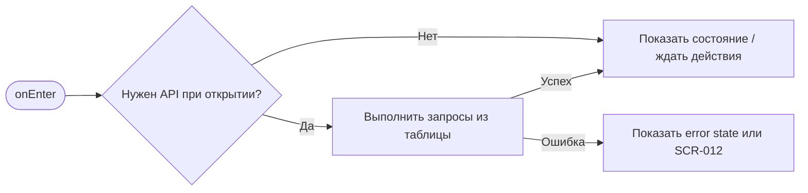
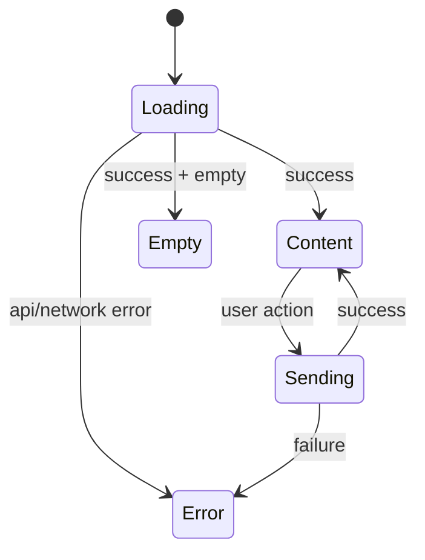

# SCR-006. Форма бронирования

**ID:** SCR-006  
**Тип:** Экран / состояние  
**Домен:** MVP мобильного приложения «Апекс»  
**Приоритет:** Critical  
**Статус:** Актуален  
**Функциональные блоки:** LOGIC-004 Создание брони, LOGIC-007 Обработка ошибок API  
**Зона авторизации:** АЗ  
**Дизайн-макет:** не предоставлен; исходная постановка дизайна — [`scr-006-forma-bronirovaniya.md`](../00_Исходники/scr-006-forma-bronirovaniya.md).

---

## История изменений

| Релиз | ТЗ | Описание изменений |
|---|---|---|
| 1.0.0-mvp | SCR-006. Форма бронирования | Первичная постановка ТЗ по дизайну, API и шаблону |

---

## Обзор

Пользователь должен указать обязательные данные и согласия, чтобы отправить заявку на бронирование одного места.

### Контекст появления

Экран открывается после нажатия «Забронировать» на SCR-005.

### Главный дизайн-акцент

Пользователь должен понимать, что создаёт заявку на одно место, а бронь после отправки будет ожидать подтверждения центром.

### User Story

> Как клиент картинг-центра, я хочу выполнить сценарий «Форма бронирования», чтобы пользоваться MVP без лишних действий и не сталкиваться с недоступными функциями.

### Бизнес-ценность

- Закрывает обязательный пользовательский сценарий MVP.
- Использует только функции, описанные в требованиях и OpenAPI.
- Не добавляет исключённые функции: оплату, групповое бронирование, фильтры, экипировку, лояльность и административные действия.

---

## Навигация

### Входящая

| Источник | Триггер / условие | Передаваемые параметры |
|---|---|---|
| Сценарии приложения | из SCR-005 по нажатию «Забронировать» при доступном слоте и авторизации | см. параметры в разделе входных данных |

### Исходящая

| Назначение | Триггер / условие | Передаваемые параметры |
|---|---|---|
| Сценарии приложения | SCR-007 при 201; SCR-012 при отказе; SCR-005 назад | зависит от действия и ответа API |

---

## Входные данные

| Название | Тип | Возможные значения | Описание |
|---|---|---|---|
| accessToken | Защищённое хранилище | JWT / отсутствует | Используется на защищённых экранах и при возврате из авторизации |
| slotId | Параметр навигации | string | Используется в сценариях слота, если применимо |
| bookingId | Параметр навигации / push payload | string | Используется в сценариях брони, если применимо |
| returnTo | Состояние навигации | SCR-* | Маршрут возврата после авторизации |

---

## Применяемые логики

| Логика | Элемент/Триггер | Описание |
|---|---|---|
| LOGIC-004 Создание брони | см. экранные действия | Переиспользуемая логика вынесена в раздел 09_Логики |
| LOGIC-007 Обработка ошибок API | см. экранные действия | Переиспользуемая логика вынесена в раздел 09_Логики |

---

## Инициализация

### Диаграмма загрузки



### Запросы при открытии / действии

| № | Запрос | Критичный | Условие |
|---|---|---|---|
| 1 | POST /bookings | Нет/по действию | см. секцию API |

---

## Используемые запросы

### POST /bookings

**Тип:** REST  
**Спецификация:** [`00_Исходники/openapi-apex-mobile.yaml`](../00_Исходники/openapi-apex-mobile.yaml) → `createBooking`  
**Назначение:** Создать бронь на одно место

**Параметры:**

| Параметр | Тип | Обязательность | Описание |
|---|---|---|---|
| — | — | — | Нет path/query параметров |

**Body:**

| Параметр | Тип | Обязательность | Описание |
|---|---|---|---|
| body | CreateBookingRequest | Да | JSON body по OpenAPI |

**Ответы:**

| Код | Описание |
|---|---|
| 201 | Бронь создана и ожидает подтверждения. |
| 400 | Ошибка валидации входных данных. |
| 401 | Клиент не авторизован или токен недействителен. |
| 409 | Бронь невозможна из-за состояния слота, отсутствия мест или двойной брони. |
| 422 | Возраст, согласия или обязательные данные не соответствуют правилам бронирования. |
| 500 | Внутренняя ошибка backend без раскрытия технических деталей клиенту. |


---

## Макет экрана

```text
┌─────────────────────────────────────┐
│ Header / статус / навигация         │
├─────────────────────────────────────┤
│ Основной контент                    │
│ Поля, карточки, состояния или текст │
├─────────────────────────────────────┤
│ Primary / Secondary actions         │
└─────────────────────────────────────┘
```

---

## Элементы экрана

### Обязательный контент

- Краткое резюме выбранного заезда: дата, время, трасса, цена.
- Поле «Имя».
- Поле «Телефон».
- Поле «Email».
- Поле «Возраст».
- Чекбокс согласия с правилами безопасности.
- Дополнительное согласие родителя / законного представителя, если возраст меньше 18 лет.
- Пояснение, что минимальный возраст участия — 16 лет.
- Пояснение, что бронь будет ожидать подтверждения.
- Основная кнопка отправки заявки.

### Микрокопирайтинг

- Заголовок: «Бронирование заезда».
- Пояснение: «Вы бронируете одно место. Центр подтвердит бронь вручную».
- Чекбокс: «Я согласен с правилами безопасности».
- Чекбокс для 16–17 лет: «Есть согласие родителя или законного представителя».
- Кнопка: «Отправить заявку».
- Ошибка возраста: «Участие доступно с 16 лет».
- Ошибка обязательного поля: «Заполните это поле».

### Не проектировать

- Выбор нескольких мест.
- Оплату.
- Промокоды.
- Выбор экипировки.
- Автоматическое подтверждение брони.

---

## Состояния экрана

- Форма пустая.
- Форма частично заполнена.
- Ошибки в обязательных полях.
- Возраст меньше 16 лет.
- Возраст 16–17 лет с необязательным / неотмеченным родительским согласием.
- Все данные валидны.
- Отправка заявки.
- Отказ бронирования от API — см. SCR-012.

### Диаграмма переходов



---

## Действия пользователя

| Действие | Ожидаемый результат |
|---|---|
| Заполнить обязательные поля | Форма становится готовой к отправке при соблюдении правил |
| Указать возраст 16–17 | Появляется обязательное согласие родителя / законного представителя |
| Указать возраст меньше 16 | Бронирование недоступно, показывается причина |
| Отметить согласие с правилами | Пользователь может отправить заявку при заполненных данных |
| Нажать кнопку бронирования | Приложение отправляет заявку; при успехе открывается SCR-007 |

---

## Связанные требования

BR-005, BR-012, BR-013, BR-014, BR-017, BR-018, BR-019, FR-009, FR-010, FR-011, FR-012, UC-005, US-005, US-006, US-007.

---

## Критерии приёмки

### Из дизайна

- Все обязательные поля отражены в макете.
- Отдельно предусмотрено поведение для возраста меньше 16 и 16–17 лет.
- Пользователь понимает, что бронь не подтверждается автоматически.
- Нет элементов группового бронирования и оплаты.

### Технические критерии

| ID | Критерий | Приоритет |
|---|---|---|
| AC-T01 | Дано экран открыт, Когда требуется API, Тогда выполняется только endpoint, указанный в разделе «Используемые запросы». | P0 |
| AC-T02 | Дано API вернул ошибку 4xx/5xx или сеть недоступна, Когда сценарий не может продолжиться, Тогда пользователь видит понятное состояние без внутренних кодов. | P0 |
| AC-T03 | Дано действие недоступно по данным API (`canBook`, `canCancel`, `status`), Когда экран отображается, Тогда CTA не выглядит доступным. | P0 |
| AC-T04 | Дано пользователь проходит сценарий через авторизацию, Когда вход успешен, Тогда приложение возвращает его в сохранённый `returnTo`. | P1 |

---

## Обработка ошибок и ограничений

- Нельзя отправить форму без имени, телефона, email, возраста и согласия с правилами безопасности.
- Нельзя забронировать участие при возрасте меньше 16 лет.
- Для клиента младше 18 лет нужно отдельное согласие родителя или законного представителя.
- Один аккаунт может забронировать только одно место в одном заезде.
- Групповое бронирование не поддерживается.
