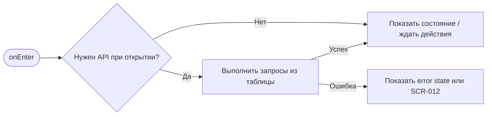
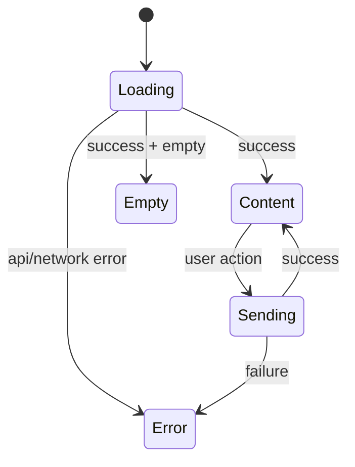

# SCR-007. Бронь создана: ожидает подтверждения

**ID:** SCR-007  
**Тип:** Экран / состояние  
**Домен:** MVP мобильного приложения «Апекс»  
**Приоритет:** Critical  
**Статус:** Актуален  
**Функциональные блоки:** LOGIC-004 Создание брони, LOGIC-005 Статусы брони и отмена  
**Зона авторизации:** АЗ  
**Дизайн-макет:** не предоставлен; исходная постановка дизайна — [`scr-007-bron-sozdana-ozhidaet-podtverzhdeniya.md`](../00_Исходники/scr-007-bron-sozdana-ozhidaet-podtverzhdeniya.md).

---

## История изменений

| Релиз | ТЗ | Описание изменений |
|---|---|---|
| 1.0.0-mvp | SCR-007. Бронь создана: ожидает подтверждения | Первичная постановка ТЗ по дизайну, API и шаблону |

---

## Обзор

Пользователь должен понять, что заявка на бронирование создана, но центр ещё не подтвердил бронь.

### Контекст появления

Экран открывается после успешной отправки заявки на бронирование из SCR-006.

### Главный дизайн-акцент

Нельзя создавать ощущение, что бронь уже активна. Главный статус — «Ожидает подтверждения».

### User Story

> Как клиент картинг-центра, я хочу выполнить сценарий «Бронь создана: ожидает подтверждения», чтобы пользоваться MVP без лишних действий и не сталкиваться с недоступными функциями.

### Бизнес-ценность

- Закрывает обязательный пользовательский сценарий MVP.
- Использует только функции, описанные в требованиях и OpenAPI.
- Не добавляет исключённые функции: оплату, групповое бронирование, фильтры, экипировку, лояльность и административные действия.

---

## Навигация

### Входящая

| Источник | Триггер / условие | Передаваемые параметры |
|---|---|---|
| Сценарии приложения | после успешного POST /bookings из SCR-006 | см. параметры в разделе входных данных |

### Исходящая

| Назначение | Триггер / условие | Передаваемые параметры |
|---|---|---|
| Сценарии приложения | SCR-009 по «Открыть бронь»; SCR-003 по «Выбрать другой заезд» | зависит от действия и ответа API |

---

## Входные данные

| Название | Тип | Возможные значения | Описание |
|---|---|---|---|
| accessToken | Защищённое хранилище | JWT / отсутствует | Используется на защищённых экранах и при возврате из авторизации |
| slotId | Параметр навигации | string | Используется в сценариях слота, если применимо |
| bookingId | Параметр навигации / push payload | string | Используется в сценариях брони, если применимо |
| returnTo | Состояние навигации | SCR-* | Маршрут возврата после авторизации |

---

## Применяемые логики

| Логика | Элемент/Триггер | Описание |
|---|---|---|
| LOGIC-004 Создание брони | см. экранные действия | Переиспользуемая логика вынесена в раздел 09_Логики |
| LOGIC-005 Статусы брони и отмена | см. экранные действия | Переиспользуемая логика вынесена в раздел 09_Логики |

---

## Инициализация

### Диаграмма загрузки



### Запросы при открытии / действии

| № | Запрос | Критичный | Условие |
|---|---|---|---|
| 1 | GET /bookings/{bookingId} | Да | см. секцию API |

---

## Используемые запросы

### GET /bookings/{bookingId}

**Тип:** REST  
**Спецификация:** [`00_Исходники/openapi-apex-mobile.yaml`](../00_Исходники/openapi-apex-mobile.yaml) → `getBooking`  
**Назначение:** Получить детали брони

**Параметры:**

| Параметр | Тип | Обязательность | Описание |
|---|---|---|---|
| bookingId | string | Да | Идентификатор брони. |

**Body:**

| Параметр | Тип | Обязательность | Описание |
|---|---|---|---|
| — | — | — | Нет тела запроса |

**Ответы:**

| Код | Описание |
|---|---|
| 200 | Детали брони. |
| 401 | Клиент не авторизован или токен недействителен. |
| 403 | Действие запрещено для текущего клиента. |
| 404 | Запрошенный объект не найден. |
| 500 | Внутренняя ошибка backend без раскрытия технических деталей клиенту. |


---

## Макет экрана

```text
┌─────────────────────────────────────┐
│ Header / статус / навигация         │
├─────────────────────────────────────┤
│ Основной контент                    │
│ Поля, карточки, состояния или текст │
├─────────────────────────────────────┤
│ Primary / Secondary actions         │
└─────────────────────────────────────┘
```

---

## Элементы экрана

### Обязательный контент

- Явный статус «Ожидает подтверждения».
- Краткое резюме заезда: дата, время, трасса, адрес.
- Пояснение, что подтверждение выполняется администратором вручную.
- Переход к деталям брони.
- Переход к списку заездов.

### Микрокопирайтинг

- Заголовок: «Заявка отправлена».
- Статус: «Ожидает подтверждения».
- Пояснение: «Администратор центра проверит заявку и подтвердит или отклонит бронь».
- Кнопка: «Открыть бронь».
- Вторичная кнопка: «Выбрать другой заезд».

### Не проектировать

- Автоматическое подтверждение.
- Таймер истечения заявки.
- Оплату после заявки.

---

## Состояния экрана

- Бронь создана и ожидает подтверждения.
- Бронь долго ожидает подтверждения — статус остаётся тем же.

### Диаграмма переходов



---

## Действия пользователя

| Действие | Ожидаемый результат |
|---|---|
| Открыть бронь | Открывается SCR-009 |
| Вернуться к заездам | Открывается SCR-003 |
| Закрыть экран результата | Пользователь попадает в логичную точку приложения, например «Мои брони» |

---

## Связанные требования

BR-019, BR-020, BR-021, FR-013, FR-016, UC-006, US-008.

---

## Критерии приёмки

### Из дизайна

- Пользователь ясно видит промежуточный статус.
- Есть путь к деталям брони.
- Нет обещаний подтверждения, которых нет в требованиях.

### Технические критерии

| ID | Критерий | Приоритет |
|---|---|---|
| AC-T01 | Дано экран открыт, Когда требуется API, Тогда выполняется только endpoint, указанный в разделе «Используемые запросы». | P0 |
| AC-T02 | Дано API вернул ошибку 4xx/5xx или сеть недоступна, Когда сценарий не может продолжиться, Тогда пользователь видит понятное состояние без внутренних кодов. | P0 |
| AC-T03 | Дано действие недоступно по данным API (`canBook`, `canCancel`, `status`), Когда экран отображается, Тогда CTA не выглядит доступным. | P0 |
| AC-T04 | Дано пользователь проходит сценарий через авторизацию, Когда вход успешен, Тогда приложение возвращает его в сохранённый `returnTo`. | P1 |

---

## Обработка ошибок и ограничений

- Не показывать статус «Активна» до подтверждения центром.
- Не обещать точное время подтверждения, если оно не задано в домене.
- Не показывать автоматический тайм-аут подтверждения.
