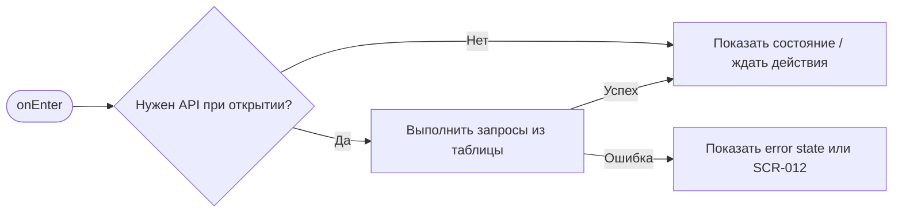
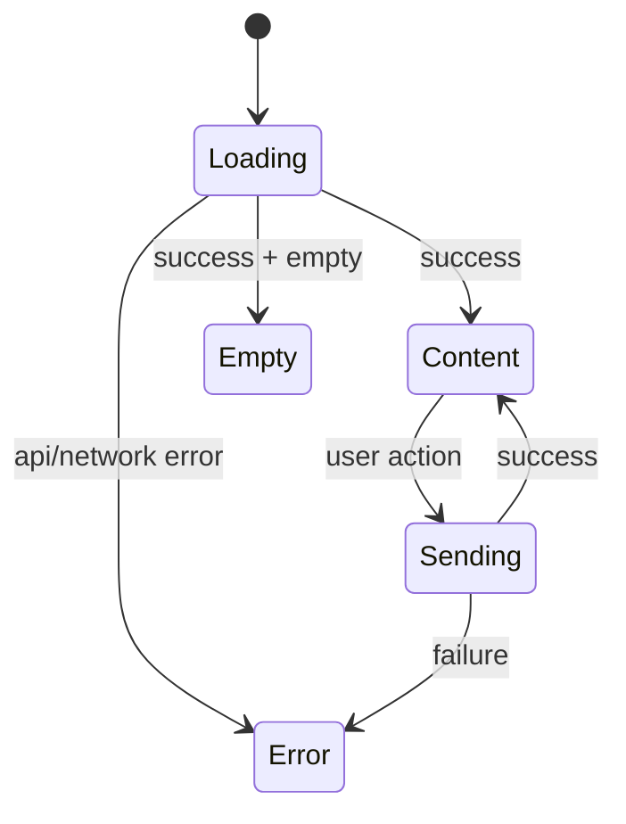

# SCR-008. Мои брони

**ID:** SCR-008  
**Тип:** Экран / состояние  
**Домен:** MVP мобильного приложения «Апекс»  
**Приоритет:** Critical  
**Статус:** Актуален  
**Функциональные блоки:** LOGIC-005 Статусы брони и отмена, LOGIC-007 Обработка ошибок API  
**Зона авторизации:** АЗ  
**Дизайн-макет:** не предоставлен; исходная постановка дизайна — [`scr-008-moi-broni.md`](../00_Исходники/scr-008-moi-broni.md).

---

## История изменений

| Релиз | ТЗ | Описание изменений |
|---|---|---|
| 1.0.0-mvp | SCR-008. Мои брони | Первичная постановка ТЗ по дизайну, API и шаблону |

---

## Обзор

Пользователь должен увидеть свои брони и их актуальные статусы.

### Контекст появления

Экран доступен из основной навигации, результата бронирования и переходов из уведомлений.

### Главный дизайн-акцент

Главный элемент карточки брони — её статус. Пользователь должен быстро отличать активные, ожидающие, отменённые, отклонённые и завершённые брони.

### User Story

> Как клиент картинг-центра, я хочу выполнить сценарий «Мои брони», чтобы пользоваться MVP без лишних действий и не сталкиваться с недоступными функциями.

### Бизнес-ценность

- Закрывает обязательный пользовательский сценарий MVP.
- Использует только функции, описанные в требованиях и OpenAPI.
- Не добавляет исключённые функции: оплату, групповое бронирование, фильтры, экипировку, лояльность и административные действия.

---

## Навигация

### Входящая

| Источник | Триггер / условие | Передаваемые параметры |
|---|---|---|
| Сценарии приложения | из основной навигации; из результатов бронирования/отмены; после push при необходимости | см. параметры в разделе входных данных |

### Исходящая

| Назначение | Триггер / условие | Передаваемые параметры |
|---|---|---|
| Сценарии приложения | SCR-009 по карточке; SCR-003 из empty state; SCR-001 при 401 | зависит от действия и ответа API |

---

## Входные данные

| Название | Тип | Возможные значения | Описание |
|---|---|---|---|
| accessToken | Защищённое хранилище | JWT / отсутствует | Используется на защищённых экранах и при возврате из авторизации |
| slotId | Параметр навигации | string | Используется в сценариях слота, если применимо |
| bookingId | Параметр навигации / push payload | string | Используется в сценариях брони, если применимо |
| returnTo | Состояние навигации | SCR-* | Маршрут возврата после авторизации |

---

## Применяемые логики

| Логика | Элемент/Триггер | Описание |
|---|---|---|
| LOGIC-005 Статусы брони и отмена | см. экранные действия | Переиспользуемая логика вынесена в раздел 09_Логики |
| LOGIC-007 Обработка ошибок API | см. экранные действия | Переиспользуемая логика вынесена в раздел 09_Логики |

---

## Инициализация

### Диаграмма загрузки



### Запросы при открытии / действии

| № | Запрос | Критичный | Условие |
|---|---|---|---|
| 1 | GET /bookings | Да | см. секцию API |

---

## Используемые запросы

### GET /bookings

**Тип:** REST  
**Спецификация:** [`00_Исходники/openapi-apex-mobile.yaml`](../00_Исходники/openapi-apex-mobile.yaml) → `listMyBookings`  
**Назначение:** Получить мои брони

**Параметры:**

| Параметр | Тип | Обязательность | Описание |
|---|---|---|---|
| status | string | Нет | Необязательный фильтр по статусу брони. В MVP приложение может не использовать фильтры в интерфейсе. |
| limit | integer | Нет |  |
| cursor | string | Нет |  |

**Body:**

| Параметр | Тип | Обязательность | Описание |
|---|---|---|---|
| — | — | — | Нет тела запроса |

**Ответы:**

| Код | Описание |
|---|---|
| 200 | Список броней клиента. |
| 401 | Клиент не авторизован или токен недействителен. |
| 500 | Внутренняя ошибка backend без раскрытия технических деталей клиенту. |


---

## Макет экрана

```text
┌─────────────────────────────────────┐
│ Header / статус / навигация         │
├─────────────────────────────────────┤
│ Основной контент                    │
│ Поля, карточки, состояния или текст │
├─────────────────────────────────────┤
│ Primary / Secondary actions         │
└─────────────────────────────────────┘
```

---

## Элементы экрана

### Обязательный контент

Для каждой брони показать:

- дату и время заезда;
- краткое описание заезда / трассы;
- адрес или центр;
- статус брони;
- признак доступности действия, если применимо.

На уровне экрана показать:

- заголовок «Мои брони»;
- список броней;
- пустое состояние, если броней нет.

### Микрокопирайтинг

- Заголовок: «Мои брони».
- Пустое состояние: «У вас пока нет броней».
- Кнопка пустого состояния: «Выбрать заезд».
- Ошибка: «Не удалось загрузить брони. Попробуйте ещё раз».

### Не проектировать

- Историю оплат.
- Оценку прошедшего заезда.
- Программу лояльности.

---

## Состояния экрана

- Есть будущие активные брони.
- Есть брони в ожидании подтверждения.
- Есть отменённые / отклонённые / завершённые брони.
- Нет броней.
- Ошибка загрузки броней.

### Диаграмма переходов



---

## Действия пользователя

| Действие | Ожидаемый результат |
|---|---|
| Нажать на бронь | Открывается SCR-009 |
| Нажать «Выбрать заезд» в пустом состоянии | Открывается SCR-003 |
| Перейти в раздел «Заезды» | Открывается SCR-003 |

---

## Связанные требования

BR-006, FR-017, FR-018, UC-009, US-011.

---

## Критерии приёмки

### Из дизайна

- Все поддерживаемые статусы имеют визуальное представление.
- Пустое состояние ведёт к выбору заезда.
- Карточка брони даёт достаточно информации для выбора нужной брони.

### Технические критерии

| ID | Критерий | Приоритет |
|---|---|---|
| AC-T01 | Дано экран открыт, Когда требуется API, Тогда выполняется только endpoint, указанный в разделе «Используемые запросы». | P0 |
| AC-T02 | Дано API вернул ошибку 4xx/5xx или сеть недоступна, Когда сценарий не может продолжиться, Тогда пользователь видит понятное состояние без внутренних кодов. | P0 |
| AC-T03 | Дано действие недоступно по данным API (`canBook`, `canCancel`, `status`), Когда экран отображается, Тогда CTA не выглядит доступным. | P0 |
| AC-T04 | Дано пользователь проходит сценарий через авторизацию, Когда вход успешен, Тогда приложение возвращает его в сохранённый `returnTo`. | P1 |

---

## Обработка ошибок и ограничений

- Не скрывать брони со статусами «Отменена центром», «Отклонена центром», «Завершена», «Неявка», если они возвращаются API как пользовательские брони.
- Не давать отменить бронь прямо из списка, если для этого требуется подтверждение на SCR-010.
