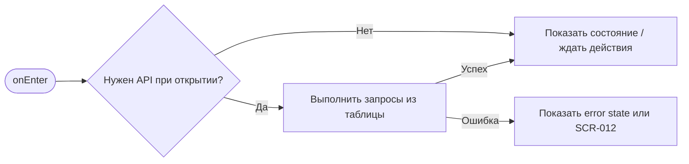
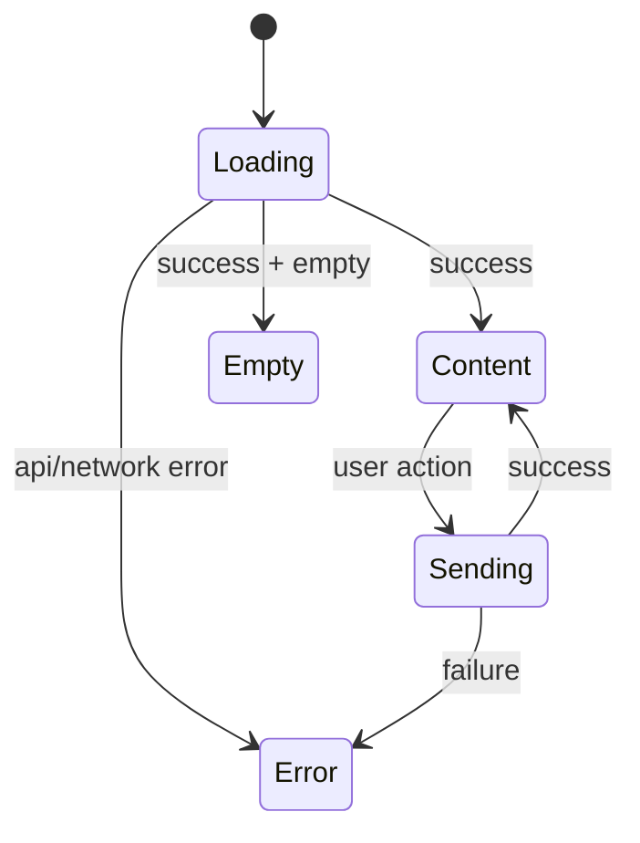

# SCR-009. Детали брони

**ID:** SCR-009  
**Тип:** Экран / состояние  
**Домен:** MVP мобильного приложения «Апекс»  
**Приоритет:** Critical  
**Статус:** Актуален  
**Функциональные блоки:** LOGIC-005 Статусы брони и отмена, LOGIC-006 Push-уведомления, LOGIC-007 Обработка ошибок API  
**Зона авторизации:** АЗ  
**Дизайн-макет:** не предоставлен; исходная постановка дизайна — [`scr-009-detali-broni.md`](../00_Исходники/scr-009-detali-broni.md).

---

## История изменений

| Релиз | ТЗ | Описание изменений |
|---|---|---|
| 1.0.0-mvp | SCR-009. Детали брони | Первичная постановка ТЗ по дизайну, API и шаблону |

---

## Обзор

Пользователь должен увидеть полную информацию по выбранной брони, её актуальный статус и доступные действия.

### Контекст появления

Экран открывается:

- из списка «Мои брони»;
- из экрана результата бронирования;
- из push-уведомлений о подтверждении, отклонении, напоминании или отмене центром.

### Главный дизайн-акцент

Экран должен быть статусоцентричным: состояние брони определяет доступные действия и основной текст.

### User Story

> Как клиент картинг-центра, я хочу выполнить сценарий «Детали брони», чтобы пользоваться MVP без лишних действий и не сталкиваться с недоступными функциями.

### Бизнес-ценность

- Закрывает обязательный пользовательский сценарий MVP.
- Использует только функции, описанные в требованиях и OpenAPI.
- Не добавляет исключённые функции: оплату, групповое бронирование, фильтры, экипировку, лояльность и административные действия.

---

## Навигация

### Входящая

| Источник | Триггер / условие | Передаваемые параметры |
|---|---|---|
| Сценарии приложения | из SCR-008, SCR-007, push-уведомления или deep link | см. параметры в разделе входных данных |

### Исходящая

| Назначение | Триггер / условие | Передаваемые параметры |
|---|---|---|
| Сценарии приложения | SCR-010 при доступной отмене; SCR-003 для отменённых/отклонённых; SCR-012 при ошибке | зависит от действия и ответа API |

---

## Входные данные

| Название | Тип | Возможные значения | Описание |
|---|---|---|---|
| accessToken | Защищённое хранилище | JWT / отсутствует | Используется на защищённых экранах и при возврате из авторизации |
| slotId | Параметр навигации | string | Используется в сценариях слота, если применимо |
| bookingId | Параметр навигации / push payload | string | Используется в сценариях брони, если применимо |
| returnTo | Состояние навигации | SCR-* | Маршрут возврата после авторизации |

---

## Применяемые логики

| Логика | Элемент/Триггер | Описание |
|---|---|---|
| LOGIC-005 Статусы брони и отмена | см. экранные действия | Переиспользуемая логика вынесена в раздел 09_Логики |
| LOGIC-006 Push-уведомления | см. экранные действия | Переиспользуемая логика вынесена в раздел 09_Логики |
| LOGIC-007 Обработка ошибок API | см. экранные действия | Переиспользуемая логика вынесена в раздел 09_Логики |

---

## Инициализация

### Диаграмма загрузки



### Запросы при открытии / действии

| № | Запрос | Критичный | Условие |
|---|---|---|---|
| 1 | GET /bookings/{bookingId} | Да | см. секцию API |

---

## Используемые запросы

### GET /bookings/{bookingId}

**Тип:** REST  
**Спецификация:** [`00_Исходники/openapi-apex-mobile.yaml`](../00_Исходники/openapi-apex-mobile.yaml) → `getBooking`  
**Назначение:** Получить детали брони

**Параметры:**

| Параметр | Тип | Обязательность | Описание |
|---|---|---|---|
| bookingId | string | Да | Идентификатор брони. |

**Body:**

| Параметр | Тип | Обязательность | Описание |
|---|---|---|---|
| — | — | — | Нет тела запроса |

**Ответы:**

| Код | Описание |
|---|---|
| 200 | Детали брони. |
| 401 | Клиент не авторизован или токен недействителен. |
| 403 | Действие запрещено для текущего клиента. |
| 404 | Запрошенный объект не найден. |
| 500 | Внутренняя ошибка backend без раскрытия технических деталей клиенту. |


---

## Макет экрана

```text
┌─────────────────────────────────────┐
│ Header / статус / навигация         │
├─────────────────────────────────────┤
│ Основной контент                    │
│ Поля, карточки, состояния или текст │
├─────────────────────────────────────┤
│ Primary / Secondary actions         │
└─────────────────────────────────────┘
```

---

## Элементы экрана

### Обязательный контент

- Статус брони.
- Дата и время заезда.
- Длительность, если доступна в данных брони / слота.
- Конфигурация трассы.
- Уровень.
- Цена.
- Адрес центра.
- Место сбора, если доступно из данных слота.
- Условия отмены.
- Причина отмены центром, если статус «Отменена центром».
- Доступные действия по статусу.

### Микрокопирайтинг

- Статус: «Ожидает подтверждения».
- Статус: «Активна».
- Статус: «Отменена центром».
- Статус: «Отклонена центром».
- Запрет отмены: «Отменить бронь через приложение можно более чем за 1 час до старта».
- Кнопка: «Отменить бронь».
- Кнопка: «Выбрать другой заезд».

### Не проектировать

- Повтор той же брони в один клик.
- Оплату или возврат оплаты.
- Обращение к администратору, если такой канал не описан в требованиях.

---

## Состояния экрана

- Ожидает подтверждения.
- Активна.
- Отменена клиентом.
- Отменена центром.
- Отклонена центром.
- Завершена.
- Неявка.
- Отмена разрешена.
- Отмена запрещена, потому что до старта осталось 1 час или меньше.
- Ошибка загрузки брони.

### Диаграмма переходов



---

## Действия пользователя

| Статус брони | Основное действие | Поведение |
|---|---|---|
| Ожидает подтверждения | «Отменить бронь», если до старта больше 1 часа | Открывается SCR-010 |
| Активна | «Отменить бронь», если до старта больше 1 часа | Открывается SCR-010 |
| Ожидает подтверждения / Активна, до старта 1 час или меньше | Отмена недоступна | Показать объяснение запрета |
| Отменена центром | «Выбрать другой заезд» | Открывается SCR-003 |
| Отклонена центром | «Выбрать другой заезд» | Открывается SCR-003 |
| Отменена клиентом | «Выбрать другой заезд» | Открывается SCR-003 |
| Завершена | Нет основного действия MVP | Информационный просмотр |
| Неявка | Нет основного действия MVP | Информационный просмотр |

---

## Связанные требования

BR-006, BR-007, BR-022, BR-024, BR-025, FR-014, FR-015, FR-018, FR-019, FR-020, FR-022, FR-023, UC-007, UC-008, UC-010, UC-011, UC-012, US-009, US-010, US-012, US-013, US-015.

---

## Критерии приёмки

### Из дизайна

- Для каждого статуса брони есть отдельный визуальный вариант.
- Действия соответствуют статусу и порогу отмены.
- Отмена центром содержит причину и CTA выбора другого заезда.
- Переход из push ведёт к состоянию, которое объясняет событие уведомления.

### Технические критерии

| ID | Критерий | Приоритет |
|---|---|---|
| AC-T01 | Дано экран открыт, Когда требуется API, Тогда выполняется только endpoint, указанный в разделе «Используемые запросы». | P0 |
| AC-T02 | Дано API вернул ошибку 4xx/5xx или сеть недоступна, Когда сценарий не может продолжиться, Тогда пользователь видит понятное состояние без внутренних кодов. | P0 |
| AC-T03 | Дано действие недоступно по данным API (`canBook`, `canCancel`, `status`), Когда экран отображается, Тогда CTA не выглядит доступным. | P0 |
| AC-T04 | Дано пользователь проходит сценарий через авторизацию, Когда вход успешен, Тогда приложение возвращает его в сохранённый `returnTo`. | P1 |

---

## Обработка ошибок и ограничений

- Нельзя позволять отмену, если до старта осталось 1 час или меньше.
- При отмене центром бронь не удаляется из интерфейса, а показывается со статусом «Отменена центром».
- Для отмены центром обязательно показать причину, дату и время отменённого заезда.
- Для отклонения центром не показывать бронь как активную.
