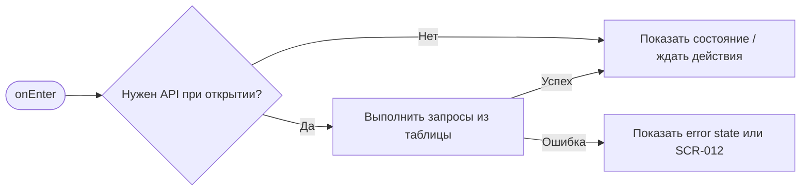
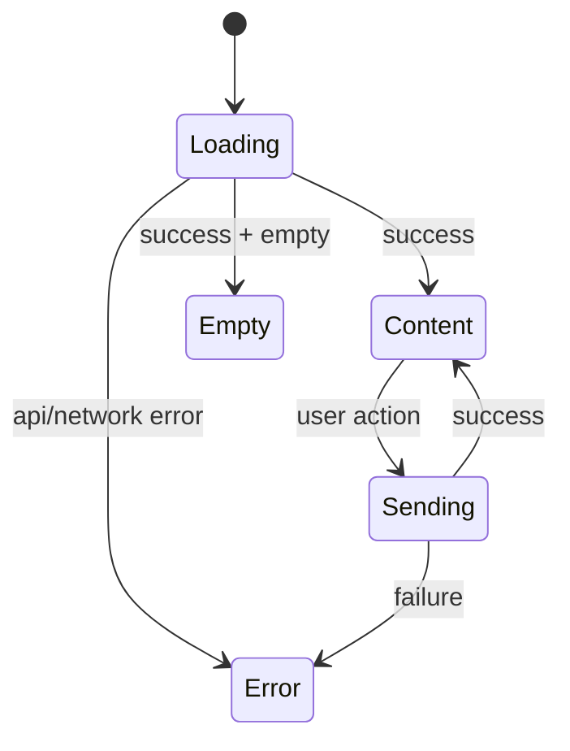

# SCR-010. Подтверждение отмены брони клиентом

**ID:** SCR-010  
**Тип:** Bottom Sheet  
**Домен:** MVP мобильного приложения «Апекс»  
**Приоритет:** Critical  
**Статус:** Актуален  
**Функциональные блоки:** LOGIC-005 Статусы брони и отмена, LOGIC-007 Обработка ошибок API  
**Зона авторизации:** АЗ  
**Дизайн-макет:** не предоставлен; исходная постановка дизайна — [`scr-010-podtverzhdenie-otmeny-broni-klientom.md`](../00_Исходники/scr-010-podtverzhdenie-otmeny-broni-klientom.md).

---

## История изменений

| Релиз | ТЗ | Описание изменений |
|---|---|---|
| 1.0.0-mvp | SCR-010. Подтверждение отмены брони клиентом | Первичная постановка ТЗ по дизайну, API и шаблону |

---

## Обзор

Пользователь должен осознанно подтвердить отмену брони, если отмена разрешена правилами.

### Контекст появления

Модальное окно или bottom sheet открывается после нажатия «Отменить бронь» на SCR-009.

### Главный дизайн-акцент

Дизайн должен предотвращать случайную отмену и одновременно не усложнять разрешённое действие.

### User Story

> Как клиент картинг-центра, я хочу выполнить сценарий «Подтверждение отмены брони клиентом», чтобы пользоваться MVP без лишних действий и не сталкиваться с недоступными функциями.

### Бизнес-ценность

- Закрывает обязательный пользовательский сценарий MVP.
- Использует только функции, описанные в требованиях и OpenAPI.
- Не добавляет исключённые функции: оплату, групповое бронирование, фильтры, экипировку, лояльность и административные действия.

---

## Навигация

### Входящая

| Источник | Триггер / условие | Передаваемые параметры |
|---|---|---|
| Сценарии приложения | из SCR-009 по нажатию «Отменить бронь», если canCancel = true | см. параметры в разделе входных данных |

### Исходящая

| Назначение | Триггер / условие | Передаваемые параметры |
|---|---|---|
| Сценарии приложения | SCR-011 при успешной отмене; SCR-009 при отказе от отмены; SCR-012 при 409 | зависит от действия и ответа API |

---

## Входные данные

| Название | Тип | Возможные значения | Описание |
|---|---|---|---|
| accessToken | Защищённое хранилище | JWT / отсутствует | Используется на защищённых экранах и при возврате из авторизации |
| slotId | Параметр навигации | string | Используется в сценариях слота, если применимо |
| bookingId | Параметр навигации / push payload | string | Используется в сценариях брони, если применимо |
| returnTo | Состояние навигации | SCR-* | Маршрут возврата после авторизации |

---

## Применяемые логики

| Логика | Элемент/Триггер | Описание |
|---|---|---|
| LOGIC-005 Статусы брони и отмена | см. экранные действия | Переиспользуемая логика вынесена в раздел 09_Логики |
| LOGIC-007 Обработка ошибок API | см. экранные действия | Переиспользуемая логика вынесена в раздел 09_Логики |

---

## Инициализация

### Диаграмма загрузки



### Запросы при открытии / действии

| № | Запрос | Критичный | Условие |
|---|---|---|---|
| 1 | POST /bookings/{bookingId}/cancel | Нет/по действию | см. секцию API |

---

## Используемые запросы

### POST /bookings/{bookingId}/cancel

**Тип:** REST  
**Спецификация:** [`00_Исходники/openapi-apex-mobile.yaml`](../00_Исходники/openapi-apex-mobile.yaml) → `cancelBookingByClient`  
**Назначение:** Отменить бронь клиентом

**Параметры:**

| Параметр | Тип | Обязательность | Описание |
|---|---|---|---|
| bookingId | string | Да | Идентификатор брони. |

**Body:**

| Параметр | Тип | Обязательность | Описание |
|---|---|---|---|
| body | CancelBookingRequest | Нет | JSON body по OpenAPI |

**Ответы:**

| Код | Описание |
|---|---|
| 200 | Бронь успешно отменена клиентом. |
| 401 | Клиент не авторизован или токен недействителен. |
| 403 | Действие запрещено для текущего клиента. |
| 404 | Запрошенный объект не найден. |
| 409 | Отмена недоступна из-за статуса брони или порога в 1 час. |
| 500 | Внутренняя ошибка backend без раскрытия технических деталей клиенту. |


---

## Макет экрана

```text
┌─────────────────────────────────────┐
│ Header / статус / навигация         │
├─────────────────────────────────────┤
│ Основной контент                    │
│ Поля, карточки, состояния или текст │
├─────────────────────────────────────┤
│ Primary / Secondary actions         │
└─────────────────────────────────────┘
```

---

## Элементы экрана

### Обязательный контент

- Заголовок подтверждения отмены.
- Краткая информация о брони: дата и время заезда.
- Пояснение, что после успешной отмены место освободится.
- Основная кнопка подтверждения отмены.
- Вторичная кнопка возврата без отмены.

### Микрокопирайтинг

- Заголовок: «Отменить бронь?».
- Пояснение: «После отмены место сразу станет доступно другим клиентам».
- Основная кнопка: «Да, отменить».
- Вторичная кнопка: «Оставить бронь».

### Не проектировать

- Выбор причины отмены клиентом, если он не описан в требованиях.
- Штрафы или возвраты оплаты.

---

## Состояния экрана

- Отмена доступна.
- Отправка запроса отмены.
- Отказ отмены из-за изменившихся условий — см. SCR-012.

### Диаграмма переходов



---

## Действия пользователя

| Действие | Ожидаемый результат |
|---|---|
| Подтвердить отмену | Приложение отправляет действие отмены; при успехе открывается SCR-011 |
| Не отменять | Модальное окно закрывается, пользователь остаётся на SCR-009 |

---

## Связанные требования

BR-007, BR-022, BR-023, FR-019, FR-020, UC-010, UC-011, US-012, US-013.

---

## Критерии приёмки

### Из дизайна

- Пользователь понимает последствия отмены.
- Есть явное действие отмены и безопасный отказ от действия.
- Дизайн не требует причины отмены от клиента.

### Технические критерии

| ID | Критерий | Приоритет |
|---|---|---|
| AC-T01 | Дано экран открыт, Когда требуется API, Тогда выполняется только endpoint, указанный в разделе «Используемые запросы». | P0 |
| AC-T02 | Дано API вернул ошибку 4xx/5xx или сеть недоступна, Когда сценарий не может продолжиться, Тогда пользователь видит понятное состояние без внутренних кодов. | P0 |
| AC-T03 | Дано действие недоступно по данным API (`canBook`, `canCancel`, `status`), Когда экран отображается, Тогда CTA не выглядит доступным. | P0 |
| AC-T04 | Дано пользователь проходит сценарий через авторизацию, Когда вход успешен, Тогда приложение возвращает его в сохранённый `returnTo`. | P1 |

---

## Обработка ошибок и ограничений

- Модальное окно открывать только для активной или ожидающей брони, если до старта больше 1 часа.
- Если за время просмотра условия изменились и отмена стала недоступна, показать отказ действия.
