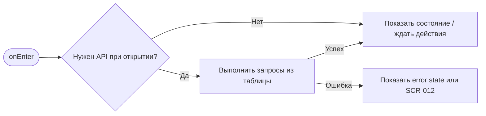
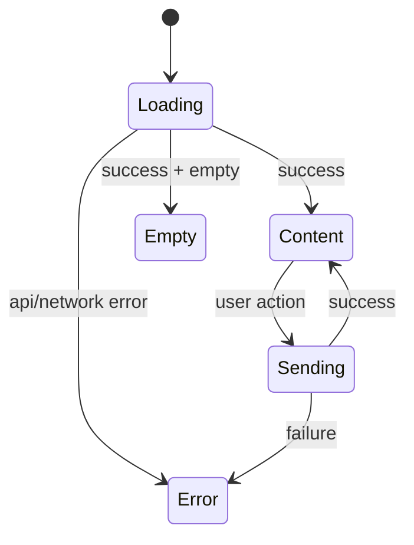

# SCR-012. Ошибка / отказ в действии

**ID:** SCR-012  
**Тип:** Экран / состояние  
**Домен:** MVP мобильного приложения «Апекс»  
**Приоритет:** Critical  
**Статус:** Актуален  
**Функциональные блоки:** LOGIC-007 Обработка ошибок API  
**Зона авторизации:** НЗ + АЗ  
**Дизайн-макет:** не предоставлен; исходная постановка дизайна — [`scr-012-oshibka-otkaz-v-deistvii.md`](../00_Исходники/scr-012-oshibka-otkaz-v-deistvii.md).

---

## История изменений

| Релиз | ТЗ | Описание изменений |
|---|---|---|
| 1.0.0-mvp | SCR-012. Ошибка / отказ в действии | Первичная постановка ТЗ по дизайну, API и шаблону |

---

## Обзор

Пользователь должен понять, почему действие не выполнено, и что можно сделать дальше.

### Контекст появления

Состояние может появиться:

- при попытке забронировать слот, если мест уже нет;
- при попытке забронировать отменённый слот;
- при отказе API в создании брони;
- при попытке отменить бронь, если действие стало недоступно;
- при других отказах API, связанных с доступностью действия.

### Главный дизайн-акцент

Ошибка должна быть предметной и пользовательской, а не технической.

### User Story

> Как клиент картинг-центра, я хочу выполнить сценарий «Ошибка / отказ в действии», чтобы пользоваться MVP без лишних действий и не сталкиваться с недоступными функциями.

### Бизнес-ценность

- Закрывает обязательный пользовательский сценарий MVP.
- Использует только функции, описанные в требованиях и OpenAPI.
- Не добавляет исключённые функции: оплату, групповое бронирование, фильтры, экипировку, лояльность и административные действия.

---

## Навигация

### Входящая

| Источник | Триггер / условие | Передаваемые параметры |
|---|---|---|
| Сценарии приложения | при бизнес-отказах API, ошибках загрузки и недоступных действиях | см. параметры в разделе входных данных |

### Исходящая

| Назначение | Триггер / условие | Передаваемые параметры |
|---|---|---|
| Сценарии приложения | SCR-003, SCR-009 или retry исходного запроса в зависимости от контекста | зависит от действия и ответа API |

---

## Входные данные

| Название | Тип | Возможные значения | Описание |
|---|---|---|---|
| accessToken | Защищённое хранилище | JWT / отсутствует | Используется на защищённых экранах и при возврате из авторизации |
| slotId | Параметр навигации | string | Используется в сценариях слота, если применимо |
| bookingId | Параметр навигации / push payload | string | Используется в сценариях брони, если применимо |
| returnTo | Состояние навигации | SCR-* | Маршрут возврата после авторизации |

---

## Применяемые логики

| Логика | Элемент/Триггер | Описание |
|---|---|---|
| LOGIC-007 Обработка ошибок API | см. экранные действия | Переиспользуемая логика вынесена в раздел 09_Логики |

---

## Инициализация

### Диаграмма загрузки



### Запросы при открытии / действии

| № | Запрос | Критичный | Условие |
|---|---|---|---|
| — | — | — | При открытии запрос не выполняется |

---

## Используемые запросы

Прямых API-запросов на экране нет; состояние получает контекст от вызывающего сценария.


---

## Макет экрана

```text
┌─────────────────────────────────────┐
│ Header / статус / навигация         │
├─────────────────────────────────────┤
│ Основной контент                    │
│ Поля, карточки, состояния или текст │
├─────────────────────────────────────┤
│ Primary / Secondary actions         │
└─────────────────────────────────────┘
```

---

## Элементы экрана

### Обязательный контент

- Короткий заголовок ошибки.
- Пояснение причины.
- Действие возврата или выбора другого заезда.
- Возможность повторить действие только там, где это осмысленно.

### Микрокопирайтинг

- «Мест больше нет».
- «Этот заезд отменён центром».
- «Бронирование сейчас недоступно».
- «Отменить бронь через приложение можно более чем за 1 час до старта».
- «Выбрать другой заезд».
- «Понятно».
- «Повторить».

### Не проектировать

- Технические детали API.
- Административные действия.
- Возможность записаться на отменённый слот.

---

## Состояния экрана

- Отказ бронирования: мест нет.
- Отказ бронирования: слот отменён.
- Отказ бронирования: бронь невозможна.
- Отказ отмены: действие недоступно.
- Ошибка загрузки данных.

### Диаграмма переходов



---

## Действия пользователя

| Ситуация | Действие | Ожидаемый результат |
|---|---|---|
| Мест больше нет | «Выбрать другой заезд» | Открывается SCR-003 |
| Слот отменён | «Выбрать другой заезд» | Открывается SCR-003 |
| Отмена брони запрещена | «Понятно» | Возврат на SCR-009 |
| Ошибка загрузки | «Повторить» | Повторная попытка загрузки |

---

## Связанные требования

BR-011, BR-025, FR-012, FR-029, NFR-001, NFR-003, NFR-004, UC-015.

---

## Критерии приёмки

### Из дизайна

- Для каждого отказа есть понятное сообщение.
- Ошибка содержит следующий полезный шаг.
- Недоступные действия не выглядят доступными.
- Отказы согласованы с правилами домена.

### Технические критерии

| ID | Критерий | Приоритет |
|---|---|---|
| AC-T01 | Дано экран открыт, Когда требуется API, Тогда выполняется только endpoint, указанный в разделе «Используемые запросы». | P0 |
| AC-T02 | Дано API вернул ошибку 4xx/5xx или сеть недоступна, Когда сценарий не может продолжиться, Тогда пользователь видит понятное состояние без внутренних кодов. | P0 |
| AC-T03 | Дано действие недоступно по данным API (`canBook`, `canCancel`, `status`), Когда экран отображается, Тогда CTA не выглядит доступным. | P0 |
| AC-T04 | Дано пользователь проходит сценарий через авторизацию, Когда вход успешен, Тогда приложение возвращает его в сохранённый `returnTo`. | P1 |

---

## Обработка ошибок и ограничений

- Не показывать пользователю внутренние коды ошибок.
- Не предлагать оплату, звонок администратору или другие действия, если они не описаны в требованиях.
- Если слот отменён центром, не позволять повторную запись на этот же слот.
