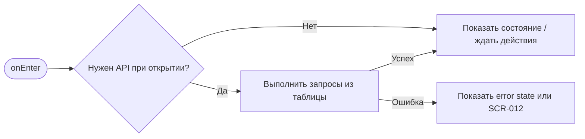
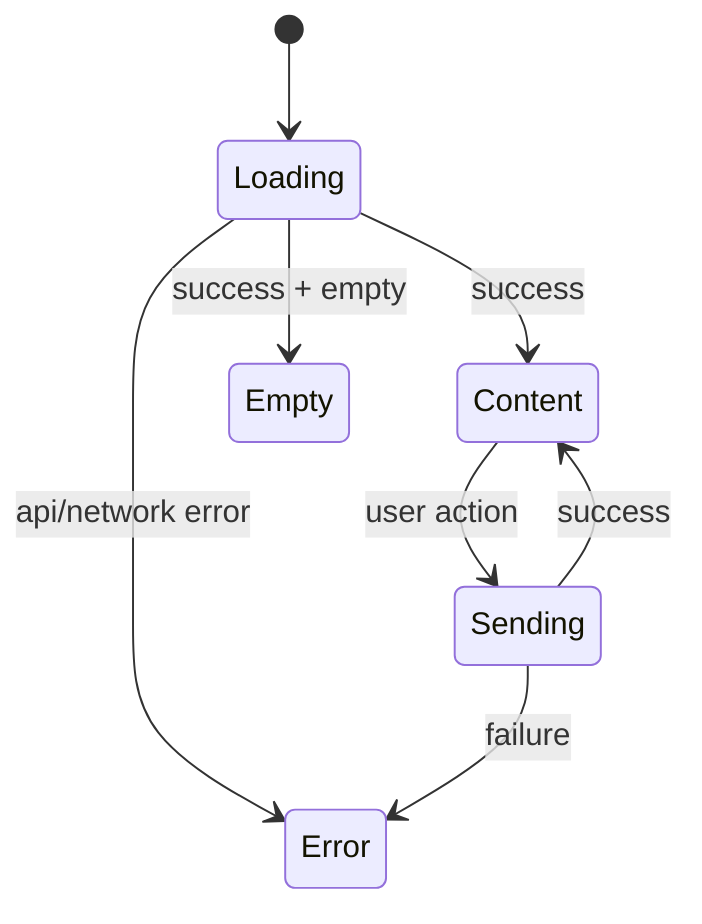

# SCR-013. Push-уведомления

**ID:** SCR-013  
**Тип:** Push-сценарий  
**Домен:** MVP мобильного приложения «Апекс»  
**Приоритет:** High  
**Статус:** Актуален  
**Функциональные блоки:** LOGIC-006 Push-уведомления, LOGIC-001 Авторизация по SMS, LOGIC-007 Обработка ошибок API  
**Зона авторизации:** НЗ + АЗ  
**Дизайн-макет:** не предоставлен; исходная постановка дизайна — [`scr-013-push-uvedomleniya.md`](../00_Исходники/scr-013-push-uvedomleniya.md).

---

## История изменений

| Релиз | ТЗ | Описание изменений |
|---|---|---|
| 1.0.0-mvp | SCR-013. Push-уведомления | Первичная постановка ТЗ по дизайну, API и шаблону |

---

## Обзор

Пользователь должен своевременно узнать о важных изменениях брони или получить напоминание о заезде.

### Контекст появления

Push-уведомления приходят вне приложения и должны вести пользователя к релевантной детали брони на SCR-009.

### Главный дизайн-акцент

Текст уведомления должен быть коротким, однозначным и связанным с конкретной бронью или заездом.

### User Story

> Как клиент картинг-центра, я хочу выполнить сценарий «Push-уведомления», чтобы пользоваться MVP без лишних действий и не сталкиваться с недоступными функциями.

### Бизнес-ценность

- Закрывает обязательный пользовательский сценарий MVP.
- Использует только функции, описанные в требованиях и OpenAPI.
- Не добавляет исключённые функции: оплату, групповое бронирование, фильтры, экипировку, лояльность и административные действия.

---

## Навигация

### Входящая

| Источник | Триггер / условие | Передаваемые параметры |
|---|---|---|
| Сценарии приложения | системная доставка push и регистрация device token после авторизации | см. параметры в разделе входных данных |

### Исходящая

| Назначение | Триггер / условие | Передаваемые параметры |
|---|---|---|
| Сценарии приложения | SCR-009 по нажатию push; SCR-001/SCR-002 если не авторизован; SCR-012 если бронь недоступна | зависит от действия и ответа API |

---

## Входные данные

| Название | Тип | Возможные значения | Описание |
|---|---|---|---|
| accessToken | Защищённое хранилище | JWT / отсутствует | Используется на защищённых экранах и при возврате из авторизации |
| slotId | Параметр навигации | string | Используется в сценариях слота, если применимо |
| bookingId | Параметр навигации / push payload | string | Используется в сценариях брони, если применимо |
| returnTo | Состояние навигации | SCR-* | Маршрут возврата после авторизации |

---

## Применяемые логики

| Логика | Элемент/Триггер | Описание |
|---|---|---|
| LOGIC-006 Push-уведомления | см. экранные действия | Переиспользуемая логика вынесена в раздел 09_Логики |
| LOGIC-001 Авторизация по SMS | см. экранные действия | Переиспользуемая логика вынесена в раздел 09_Логики |
| LOGIC-007 Обработка ошибок API | см. экранные действия | Переиспользуемая логика вынесена в раздел 09_Логики |

---

## Инициализация

### Диаграмма загрузки



### Запросы при открытии / действии

| № | Запрос | Критичный | Условие |
|---|---|---|---|
| 1 | POST /push/device-tokens | Нет/по действию | см. секцию API |
| 2 | DELETE /push/device-tokens/{deviceTokenId} | Нет/по действию | см. секцию API |
| 3 | GET /bookings/{bookingId} | Нет/по действию | см. секцию API |

---

## Используемые запросы

### POST /push/device-tokens

**Тип:** REST  
**Спецификация:** [`00_Исходники/openapi-apex-mobile.yaml`](../00_Исходники/openapi-apex-mobile.yaml) → `registerPushDeviceToken`  
**Назначение:** Зарегистрировать device token для push-уведомлений

**Параметры:**

| Параметр | Тип | Обязательность | Описание |
|---|---|---|---|
| — | — | — | Нет path/query параметров |

**Body:**

| Параметр | Тип | Обязательность | Описание |
|---|---|---|---|
| body | RegisterPushDeviceTokenRequest | Да | JSON body по OpenAPI |

**Ответы:**

| Код | Описание |
|---|---|
| 201 | Device token зарегистрирован. |
| 400 | Ошибка валидации входных данных. |
| 401 | Клиент не авторизован или токен недействителен. |
| 500 | Внутренняя ошибка backend без раскрытия технических деталей клиенту. |

### DELETE /push/device-tokens/{deviceTokenId}

**Тип:** REST  
**Спецификация:** [`00_Исходники/openapi-apex-mobile.yaml`](../00_Исходники/openapi-apex-mobile.yaml) → `unregisterPushDeviceToken`  
**Назначение:** Удалить device token

**Параметры:**

| Параметр | Тип | Обязательность | Описание |
|---|---|---|---|
| deviceTokenId | string | Да |  |

**Body:**

| Параметр | Тип | Обязательность | Описание |
|---|---|---|---|
| — | — | — | Нет тела запроса |

**Ответы:**

| Код | Описание |
|---|---|
| 204 | Device token удалён. |
| 401 | Клиент не авторизован или токен недействителен. |
| 404 | Запрошенный объект не найден. |
| 500 | Внутренняя ошибка backend без раскрытия технических деталей клиенту. |

### GET /bookings/{bookingId}

**Тип:** REST  
**Спецификация:** [`00_Исходники/openapi-apex-mobile.yaml`](../00_Исходники/openapi-apex-mobile.yaml) → `getBooking`  
**Назначение:** Получить детали брони

**Параметры:**

| Параметр | Тип | Обязательность | Описание |
|---|---|---|---|
| bookingId | string | Да | Идентификатор брони. |

**Body:**

| Параметр | Тип | Обязательность | Описание |
|---|---|---|---|
| — | — | — | Нет тела запроса |

**Ответы:**

| Код | Описание |
|---|---|
| 200 | Детали брони. |
| 401 | Клиент не авторизован или токен недействителен. |
| 403 | Действие запрещено для текущего клиента. |
| 404 | Запрошенный объект не найден. |
| 500 | Внутренняя ошибка backend без раскрытия технических деталей клиенту. |


---

## Макет экрана

```text
┌─────────────────────────────────────┐
│ Header / статус / навигация         │
├─────────────────────────────────────┤
│ Основной контент                    │
│ Поля, карточки, состояния или текст │
├─────────────────────────────────────┤
│ Primary / Secondary actions         │
└─────────────────────────────────────┘
```

---

## Элементы экрана

### Обязательный контент

| Событие | Цель уведомления | Переход по нажатию |
|---|---|---|
| Подтверждение брони администратором | Сообщить, что бронь стала активной | SCR-009 со статусом «Активна» |
| Отклонение брони администратором | Сообщить, что центр отклонил бронь | SCR-009 со статусом «Отклонена центром» |
| Напоминание за 24 часа | Напомнить о предстоящем заезде | SCR-009 |
| Напоминание за 2 часа | Напомнить о скором старте заезда | SCR-009 |
| Отмена заезда центром | Сообщить об отмене и причине в деталях | SCR-009 со статусом «Отменена центром» |

### Микрокопирайтинг

| Событие | Заголовок | Текст |
|---|---|---|
| Подтверждение | «Бронь подтверждена» | «Ваш заезд в {дата/время} подтверждён» |
| Отклонение | «Бронь отклонена» | «Центр не подтвердил бронь на {дата/время}» |
| Напоминание за 24 часа | «Заезд уже завтра» | «Напоминаем о заезде {дата/время}» |
| Напоминание за 2 часа | «Заезд через 2 часа» | «Проверьте детали брони перед поездкой» |
| Отмена центром | «Заезд отменён» | «Центр отменил заезд {дата/время}. Подробности в брони» |

### Не проектировать

- Маркетинговые push-уведомления.
- Уведомления о скидках, оплате, лояльности.
- Push о действиях администратора, кроме подтверждения, отклонения и отмены заезда центром.

---

## Состояния экрана

- Пользователь авторизован: открыть SCR-009.
- Пользователь не авторизован: сначала SCR-001 / SCR-002, затем SCR-009 при успешном входе, если такая маршрутизация поддерживается продуктово.
- Бронь недоступна или данные не загрузились: показать SCR-012.

### Диаграмма переходов



---

## Действия пользователя

Действия пользователя описаны в навигации и API-секциях.

---

## Связанные требования

BR-008, BR-009, FR-024, FR-025, FR-026, FR-027, FR-028, UC-007, UC-008, UC-012, UC-013, US-009, US-010, US-014, US-015.

---

## Критерии приёмки

### Из дизайна

- Для каждого обязательного push-события есть короткий текст.
- Все push ведут к деталям брони.
- Исключённые из MVP push-события не попали в дизайн.
- Тексты не создают ложного статуса брони.

### Технические критерии

| ID | Критерий | Приоритет |
|---|---|---|
| AC-T01 | Дано экран открыт, Когда требуется API, Тогда выполняется только endpoint, указанный в разделе «Используемые запросы». | P0 |
| AC-T02 | Дано API вернул ошибку 4xx/5xx или сеть недоступна, Когда сценарий не может продолжиться, Тогда пользователь видит понятное состояние без внутренних кодов. | P0 |
| AC-T03 | Дано действие недоступно по данным API (`canBook`, `canCancel`, `status`), Когда экран отображается, Тогда CTA не выглядит доступным. | P0 |
| AC-T04 | Дано пользователь проходит сценарий через авторизацию, Когда вход успешен, Тогда приложение возвращает его в сохранённый `returnTo`. | P1 |

---

## Обработка ошибок и ограничений

- Не использовать в push формулировки, которые противоречат статусам брони.
- Не писать, что бронь подтверждена, если событие — только создание заявки.
- Не отправлять уведомления, явно исключённые из MVP.
