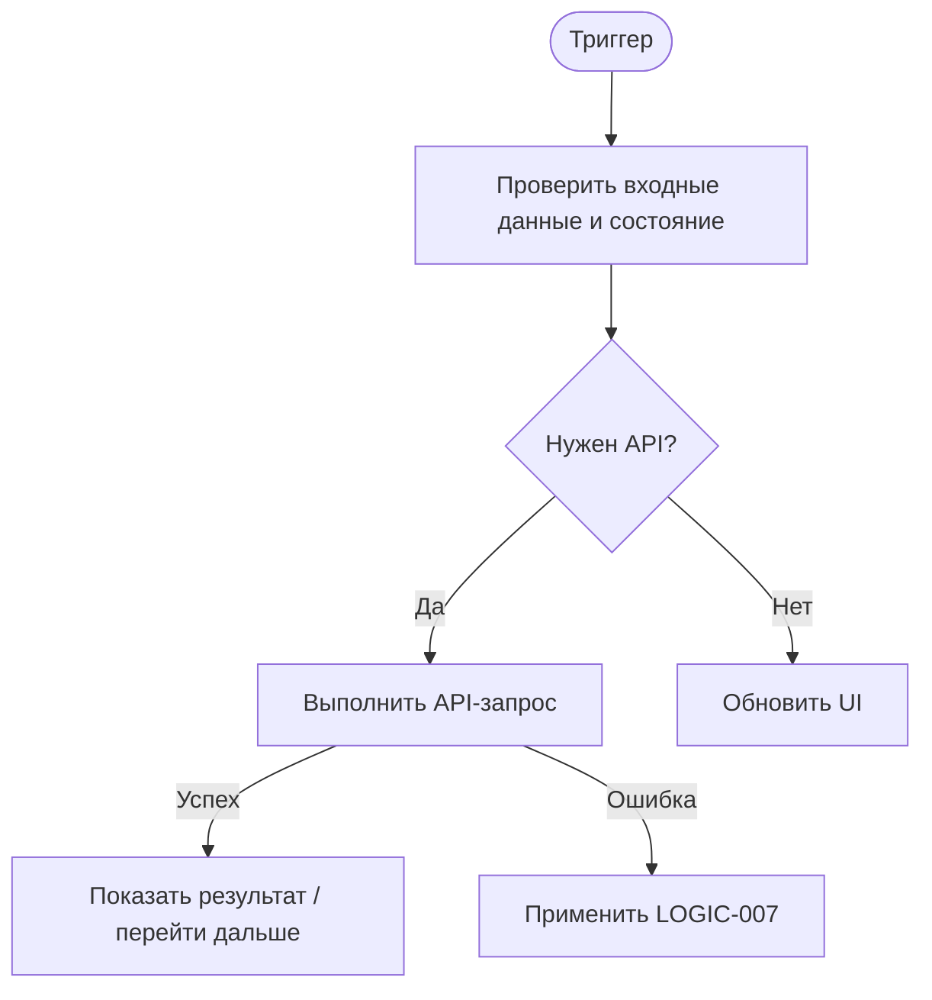

# LOGIC-002. Загрузка расписания слотов

**ID:** LOGIC-002  
**Тип:** Логика  
**Домен:** MVP мобильного приложения «Апекс»  
**Приоритет:** Critical  
**Статус:** Актуален

---

## Обзор

Получение слотов на ближайшие 7 дней, различение Content/Empty/Error и статусов доступности.

### User Story

> Как клиент, я хочу, чтобы приложение корректно выполняло эту логику, чтобы сценарии бронирования работали предсказуемо и без технических ошибок.

---

## Точки применения

| Экран/Компонент | Элемент/Триггер | Условие |
|---|---|---|
| SCR-003, SCR-004 | см. связанные экраны | Всегда при выполнении сценария |

---

## Флоу

---

## API запросы

### GET /ride-slots

**Тип:** REST  
**Спецификация:** [`00_Исходники/openapi-apex-mobile.yaml`](../00_Исходники/openapi-apex-mobile.yaml) → `listRideSlots`  
**Назначение:** Получить список слотов

**Параметры:**

| Параметр | Тип | Обязательность | Описание |
|---|---|---|---|
| days | integer | Нет | Количество дней от текущего момента. Для MVP клиент использует значение по умолчанию 7. |
| includeUnavailable | boolean | Нет | Включать занятые и отменённые слоты, чтобы приложение могло показать статусы «Мест нет» и «Отменён». |

**Body:**

| Параметр | Тип | Обязательность | Описание |
|---|---|---|---|
| — | — | — | Нет тела запроса |

**Ответы:**

| Код | Описание |
|---|---|
| 200 | Список слотов. Пустой массив означает отсутствие расписания на ближайшие дни. |
| 401 | Клиент не авторизован или токен недействителен. |
| 500 | Внутренняя ошибка backend без раскрытия технических деталей клиенту. |

---

## Правила данных

| Сущность | Значения / поля | Правило |
|---|---|---|
| RideSlotStatus | AVAILABLE, NO_FREE_PLACES, CANCELLED | Определяет доступность бронирования слота |
| BookingStatus | PENDING_CONFIRMATION, ACTIVE, CANCELLED_BY_CLIENT, CANCELLED_BY_CENTER, REJECTED_BY_CENTER, COMPLETED, NO_SHOW | Определяет статус брони и доступные действия |
| ErrorCode | VALIDATION_ERROR, INVALID_SMS_CODE, RATE_LIMIT_EXCEEDED, UNAUTHORIZED, FORBIDDEN, NOT_FOUND, NO_FREE_PLACES, SLOT_CANCELLED, DUPLICATE_BOOKING, BOOKING_RULES_VIOLATION, ACTION_UNAVAILABLE, INTERNAL_ERROR | Определяет пользовательский текст ошибки и следующий шаг |
| accessToken | Bearer JWT | Хранится в защищённом хранилище после успешной авторизации |

---

## Критерии приёмки

| ID | Критерий |
|---|---|
| AC-001 | Дано входные данные корректны, Когда логика выполняется, Тогда используется только API из раздела «API запросы». |
| AC-002 | Дано API вернул успешный ответ, Когда данные получены, Тогда UI обновляется по актуальному ответу backend. |
| AC-003 | Дано API вернул ошибку или сеть недоступна, Когда сценарий не может завершиться, Тогда применяется LOGIC-007 и не показываются технические детали. |

---

## Обработка ошибок

| Тип ошибки | Действие |
|---|---|
| VALIDATION_ERROR | Показать ошибки полей, если есть `fields` |
| UNAUTHORIZED | Открыть SCR-001 и сохранить returnTo |
| NO_FREE_PLACES / SLOT_CANCELLED / DUPLICATE_BOOKING / ACTION_UNAVAILABLE | Показать SCR-012 с предметным текстом |
| INTERNAL_ERROR / сеть | Показать error state или снек с возможностью retry |
