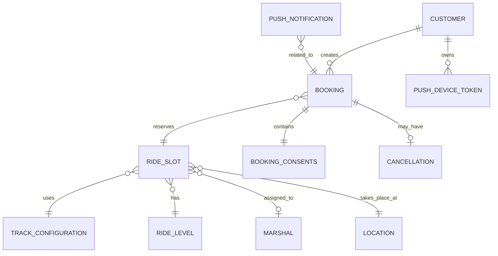

# Доменные сущности MVP приложения «Апекс»

Документ описывает доменные сущности клиентского мобильного приложения для картинг-центра «Апекс» на основе ТЗ, требований, app-spec и OpenAPI.

## 1. Границы доменной модели

В MVP входят:

- авторизация клиента по номеру телефона и SMS-коду;
- просмотр доступных заездов на ближайшие 7 дней;
- просмотр деталей слота;
- создание бронирования;
- просмотр своих броней;
- отмена брони клиентом, если до начала заезда больше 1 часа;
- получение push-уведомлений по событиям бронирования и заезда.

В MVP не входят:

- онлайн-оплата;
- групповое бронирование;
- выбор карта;
- выбор экипировки;
- оценка маршала;
- программа лояльности;
- админская панель;
- управление расписанием, трассами, маршалами и парком картов;
- автоматическое подтверждение брони;
- таймаут подтверждения брони.

## 2. Основные доменные сущности

| Сущность | Назначение | Основные атрибуты |
|---|---|---|
| `Customer` / Клиент | Пользователь мобильного приложения, который авторизуется по телефону и создаёт брони. | `customerId`, `phone`, `createdAt` |
| `CustomerProfile` / Профиль клиента | Данные клиента, необходимые для создания брони. | `fullName`, `phone`, `email`, `age` |
| `SmsCode` / SMS-код | Код подтверждения номера телефона при авторизации. | `phone`, `code`, `expiresAt`, `attempts`, `status` |
| `AuthSession` / Сессия авторизации | Результат успешного входа клиента. | `accessToken`, `tokenType`, `expiresInSeconds`, `customer` |
| `RideSlot` / Слот заезда | Конкретный заезд в расписании, доступный или недоступный для бронирования. | `slotId`, `startAt`, `durationMinutes`, `capacity`, `freePlaces`, `price`, `status`, `canBook` |
| `TrackConfiguration` / Конфигурация трассы | Тип или конфигурация трассы для заезда. | `trackConfigurationId`, `name`, `type` |
| `RideLevel` / Уровень заезда | Уровень сложности заезда. | `rideLevelId`, `name`, `code` |
| `Marshal` / Маршал | Ответственный сотрудник или инструктор заезда. | `marshalId`, `name` |
| `Location` / Локация | Место проведения заезда. В API может быть представлено строковыми полями. | `address`, `meetingPoint` |
| `Booking` / Бронь | Запись клиента на одно место в выбранном слоте. | `bookingId`, `customerId`, `slotId`, `status`, `createdAt`, `canCancel` |
| `BookingConsents` / Согласия на бронирование | Набор обязательных подтверждений при создании брони. | `safetyRulesAccepted`, `parentalConsentAccepted` |
| `Cancellation` / Отмена | Факт отмены брони или заезда. | `canceledAt`, `cancelSource`, `reasonType`, `reasonText` |
| `PushDeviceToken` / Push-токен устройства | Зарегистрированное устройство клиента для получения push-уведомлений. | `deviceTokenId`, `platform`, `token`, `appVersion`, `locale`, `createdAt` |
| `PushNotification` / Push-уведомление | Уведомление клиенту по событию брони или заезда. | `type`, `bookingId`, `title`, `body`, `rideStartAt` |
| `DomainError` / Доменная ошибка | Ошибка бизнес-действия: нет мест, слот отменён, дубль брони, действие недоступно. | `errorCode`, `message`, `fields` |

## 3. Связи между сущностями

```text
Customer 1 ── * Booking
Booking * ── 1 RideSlot
RideSlot * ── 1 TrackConfiguration
RideSlot * ── 1 RideLevel
RideSlot * ── 0..1 Marshal
RideSlot * ── 1 Location

Booking 1 ── 1 BookingConsents
Booking 1 ── 0..1 Cancellation

Customer 1 ── * PushDeviceToken
PushNotification * ── 1 Booking
```

## 4. Mermaid-диаграмма связей



## 5. Ключевые бизнес-правила

### Клиент

- Клиент авторизуется по номеру телефона.
- Номер телефона подтверждается SMS-кодом.
- Клиент может видеть только свои бронирования.
- Для создания брони клиент должен указать обязательные данные профиля.

### Бронь

- Одна бронь относится к одному слоту.
- В MVP одна бронь означает одно место.
- Групповое бронирование не поддерживается.
- После создания бронь получает статус `PENDING_CONFIRMATION`.
- Подтверждение или отклонение брони выполняется администратором во внешней системе.
- Клиент может отменить бронь только если до начала заезда больше 1 часа.
- Если до начала заезда 1 час или меньше, отмена клиентом недоступна.

### Слот заезда

- Слот отображается в расписании на ближайшие 7 дней.
- Слот может быть доступен, заполнен или отменён.
- Backend является источником истины по доступности слота и количеству свободных мест.
- Клиентское приложение не должно самостоятельно считать итоговую доступность бронирования.
- Если слот заполнен или отменён, пользователь может видеть его, но не может забронировать.

### Push-уведомления

- Push-токен устройства регистрируется после получения разрешения на уведомления.
- Уведомления отправляются по событиям бронирования и заезда.
- Возможные события: подтверждение, отклонение, напоминание, отмена центром.

## 6. Статусы слота

| Статус | Описание | Можно бронировать |
|---|---|---|
| `AVAILABLE` | Есть свободные места. | Да |
| `NO_FREE_PLACES` | Свободных мест нет. | Нет |
| `CANCELLED` | Заезд отменён центром. | Нет |

## 7. Статусы брони

| Статус | Описание |
|---|---|
| `PENDING_CONFIRMATION` | Бронь создана и ожидает подтверждения администратором. |
| `ACTIVE` | Бронь подтверждена и активна. |
| `CANCELLED_BY_CLIENT` | Бронь отменена клиентом. |
| `CANCELLED_BY_CENTER` | Бронь отменена картинг-центром. |
| `REJECTED_BY_CENTER` | Бронь отклонена картинг-центром. |
| `COMPLETED` | Заезд завершён. |
| `NO_SHOW` | Клиент не пришёл на заезд. |

## 8. Причины отмены центром

| Код | Описание |
|---|---|
| `WEATHER` | Погодные условия. |
| `TECHNICAL_FAILURE` | Техническая неисправность. |
| `TRACK_UNAVAILABLE` | Недоступность трассы. |
| `MARSHAL_UNAVAILABLE` | Недоступность маршала. |
| `ORGANIZATIONAL` | Организационная причина. |
| `OTHER` | Другая причина со свободным текстом. |

## 9. Value Objects

Эти объекты важны для доменной модели, но обычно не требуют самостоятельного жизненного цикла.

| Value Object | Где используется | Атрибуты |
|---|---|---|
| `Money` | Цена слота. | `amount`, `currency` |
| `Phone` | Авторизация, клиент, профиль брони. | `value` |
| `Email` | Профиль клиента. | `value` |
| `CancellationTerms` | Детали слота и брони. | `text` |
| `SafetyRules` | Детали слота и форма бронирования. | `text` |
| `AvailableAction` | Детали брони. | `code`, `title`, `enabled` |

## 10. Агрегаты

### 10.1. Агрегат `Customer`

```text
Customer
├── customerId
├── phone
├── createdAt
└── pushDeviceTokens[]
```

Отвечает за идентичность клиента, авторизацию и устройства для уведомлений.

### 10.2. Агрегат `RideSlot`

```text
RideSlot
├── slotId
├── startAt
├── durationMinutes
├── trackConfiguration
├── rideLevel
├── marshal
├── capacity
├── freePlaces
├── price
├── status
├── canBook
├── address
├── meetingPoint
├── safetyRules
└── cancellationTerms
```

Отвечает за отображение заезда, его доступность и данные для принятия решения о бронировании.

### 10.3. Агрегат `Booking`

```text
Booking
├── bookingId
├── customerId
├── slotId
├── profile
├── consents
├── status
├── createdAt
├── canceledAt
├── cancelSource
├── centerCancellation
├── canCancel
└── cancellationUnavailableReason
```

Главный агрегат бизнес-действий: создание брони, просмотр статуса, отмена клиентом, отображение отмены центром.

### 10.4. Агрегат `Notification`

```text
PushNotification
├── type
├── bookingId
├── title
├── body
└── rideStartAt
```

Отвечает за уведомления по событиям бронирования и заезда.

## 11. Сущности, которые не входят в MVP

Следующие сущности не нужно включать в доменную модель текущего MVP:

```text
Payment
Order
GroupBooking
EquipmentSelection
Kart
KartFleet
LoyaltyProgram
MarshalRating
AdminUser
AdminAction
TrackScheduleEditor
```

Причина: соответствующие функции вынесены за рамки MVP или относятся к существующей внешней админской системе.

## 12. Минимальный набор для реализации MVP

Для первой версии достаточно зафиксировать следующий набор доменных объектов:

```text
Customer
CustomerProfile
SmsCode
AuthSession
RideSlot
TrackConfiguration
RideLevel
Marshal
Location
Booking
BookingConsents
Cancellation
PushDeviceToken
PushNotification
Money
DomainError
```

Главные доменные сущности MVP:

```text
Customer
RideSlot
Booking
```

Именно вокруг них строятся основные пользовательские сценарии приложения.
